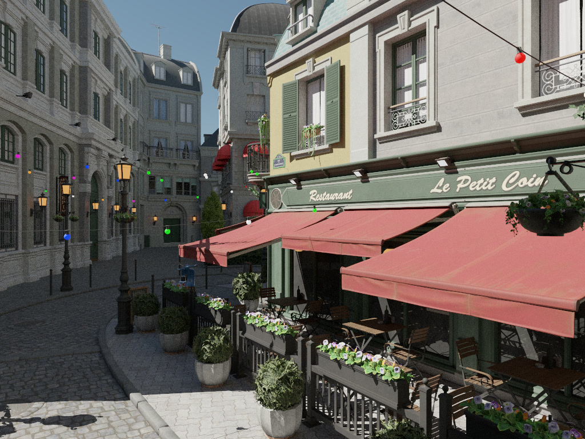

#  Amoris

Amoris is a 3D game engine with a Rust host, TypeScript gameplay, and a web editor.
The editor, CLI, and agents share one command API. A wgpu renderer runs natively
on Metal and Vulkan, and in the browser on WebGPU.

[Showcase](https://qiulinfan.github.io/amoris/) ·
[Editor guide](https://qiulinfan.github.io/amoris/documentation/editor/) ·
[Script API](https://qiulinfan.github.io/amoris/documentation/sdk/) ·
[CLI and MCP](https://qiulinfan.github.io/amoris/documentation/api/) ·
[Measurements](https://qiulinfan.github.io/amoris/documentation/data/)

[](https://qiulinfan.github.io/amoris/#showcase)

*Bistro exterior, captured with multi-bounce Metal path tracing: 512 spp and a 12-bounce limit.*

[Amazon Lumberyard / ORCA](https://developer.nvidia.com/orca/amazon-lumberyard-bistro),
CC BY 4.0. [Asset credits](site/content/credits.md).

## What you can do

- Build games with typed components and stateless TypeScript systems.
- Inspect and edit a scene through the web editor, CLI, HTTP, or MCP.
- Run Play in a fork, pause or step the simulation, and return to the edit world.
- Debug TypeScript with breakpoints, locals, watches, and source-level stepping.
- Record snapshots, replay inputs, and check deterministic runs.

The web editor combines a WebGPU viewport with a Hierarchy, Inspector, asset browser,
Monaco script editor, debugger, History, Timeline, and Profiler. Its edits and agent
commands enter the same undoable history.

## Start the editor

Install [Rust](https://rustup.rs/) and [Bun](https://bun.sh/). The repository pins its
Rust toolchain in [rust-toolchain.toml](rust-toolchain.toml).

```sh
git clone https://github.com/qiulinfan/amoris.git
cd amoris

cd sdk
bun install --frozen-lockfile
cd ../editor
bun install --frozen-lockfile
bun run build
cd ..

cargo build --release -p pocket-app
./target/release/pocket serve samples/sailing --editor editor/dist
```

Open **http://127.0.0.1:7878/** and press **Play**. The executable is currently named
`pocket`. The browser viewport requires WebGPU.

Select **Sloop** in the Hierarchy to edit its components. Open `scripts/rules.ts` to
change its gameplay; **Cmd/Ctrl+S** applies the script. Set a breakpoint in the gutter,
then use **F5**, **F10**, and **F11** to continue, step over, and step into. **Stop**
returns to the original edit world. See the [editor guide](site/content/editor.md).

For a native game window:

```sh
./target/release/pocket play samples/sailing
./target/release/pocket play samples/anim
```

## The small technology map

| Responsibility | Technology |
| --- | --- |
| Host and entities | Rust · Bevy ECS |
| Gameplay | TypeScript 7 · oxc · QuickJS-ng |
| Physics | Rapier 3D with enhanced determinism |
| Rendering | wgpu · WGSL · Metal / Vulkan / WebGPU |
| Editor | React · dockview · Monaco |
| Automation | CLI · HTTP / WebSocket · MCP |

Game state lives in components. Scripts run as stateless systems, and the renderer
reads the simulation's output. Snapshots, replay, and explicit forks operate on the
same self-contained world.

## API and agents

Discover commands and inspect a running game:

```sh
./target/release/pocket help
./target/release/pocket catalog --host http://127.0.0.1:7878 --json
./target/release/pocket world get Sloop Boat Tally --host http://127.0.0.1:7878 --json
```

Use `./target/release/pocket mcp samples/sailing` as a stdio MCP server, or connect to
the running host at `http://127.0.0.1:7878/mcp`. These tools expose the developer
command surface. Player-specific `observe` / `act` MCP tools are still pending.

- [Script API](site/content/sdk.md): components, queries, systems, events, and types.
- [CLI and MCP](site/content/api.md): discovery, world edits, time, capture, and debugging.
- [Host protocol](docs/spec/host-protocol.md): HTTP calls, WebSocket feeds, and schemas.

## Samples and measurements

| Project | Demonstrates |
| --- | --- |
| [Sailing](samples/sailing) | Wind, buoyancy, boat controls, and cargo collection |
| [Animation](samples/anim) | Animation, particles, and in-game UI |

Rendering measurements report their scene, hardware, resolution, and timing method.
Recorded demonstration videos use fixed simulation steps; playback frame rate is
separate from the engine's measured performance. See the [showcase data](site/content/data.md),
[web rendering study](docs/bench/web.md), and [physics study](docs/bench/physics.md).

### High-detail showcase

The site includes native Bistro and Flight Helmet videos, a CC0 Dutch ship controlled
through MCP, and a recording of the real WebGPU editor. Fetch the pinned CC0 models
locally to open the detailed sailing sample:

```sh
python3 tools/showcase_assets.py --projects
./target/release/pocket serve site/demos/harbor --editor editor/dist
```

At 1920 × 1080 on Apple M5 / Metal, 1,024 complete Flight Helmets contribute
96,995,330 scene triangles before culling. The static render-and-wait workload took
82.43 ms mean and 83.66 ms p95 over 300 completed frames. This excludes game simulation
and window presentation. [Method and raw data](site/content/data.md).

Large third-party models stay outside Git; the website serves compact videos and
posters. Source authors and licenses are preserved in the [credits](site/content/credits.md).

## License

Amoris is released under the [MIT License](LICENSE). Third-party dependencies and
showcase assets retain their own licenses and attribution.
