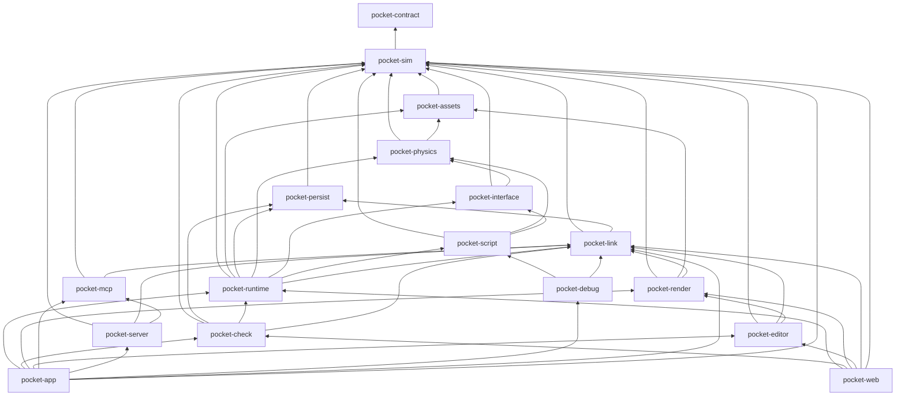

# Architecture: the Rust workspace

Status: Draft, slice 0

Charter: 3.9 (crates with one-way dependencies), 4.1 (stack and the `wasm32` build from day one),
4.2.4 (where transpiling, loading and `.d.ts` generation sit), 4.4 (rendering as a projection), 5
and 5.1 (run forms and the two threads, detailed in `threads.md`), 6.2 (`shared/`), 9.4 (code health
recorded per commit).

This specification fixes the crates of the rebuild's Rust workspace: what each owns and exports,
which crates each may depend on, which external crates may appear where, how C code inside the
workspace is compiled, and how each crate builds for `wasm32`. It does not define the concepts the
crates hold; those belong to the specifications named below, and this file only says which crate
carries them. `threads.md` specifies the game and presenter threads that run on these crates,
`checks.md` the local check command that enforces this layout, and `budgets.md` the performance
measurements and their reference figures.

## 1. Related specifications

| Owner | Concepts used here by name | File |
|---|---|---|
| spec-sim | Tick, the fixed timestep, system order, events, EntityId and its allocation, iteration order, numeric rules, the deterministic math library, the RNG | [simulation.md](simulation.md), [numeric.md](numeric.md), [rng.md](rng.md) |
| spec-persist | canonical serialization (PCE), the world hash, snapshot, restore, fork, replay, the first divergence, script and data versions, migrations | [persistence.md](persistence.md), [replay.md](replay.md), [versions.md](versions.md) |
| spec-script | the script host API, module loading, transpiling, the global freeze, the lint, the execution budget, `.d.ts` generation, project components, hot update | [script-host.md](script-host.md), [script-sandbox.md](script-sandbox.md), [hot-update.md](hot-update.md) |
| spec-contract | perception, actions and affordances, players (seats) and observers, time modes and the time controller, the error protocol (`{code, message, detail}`, the Rust type `Problem`), the `pocket-contract` types crate | [shared/contract/](../../shared/contract/README.md): [perception.md](../../shared/contract/perception.md), [actions.md](../../shared/contract/actions.md), [time.md](../../shared/contract/time.md), [errors.md](../../shared/contract/errors.md) |
| spec-mcp | the MCP tools, the benchmark | [shared/contract/mcp.md](../../shared/contract/mcp.md), [shared/benchmark/](../../shared/benchmark/README.md) |
| spec-arch (this agent) | crates, threads, the check command, budgets, the web build | `architecture.md`, `threads.md`, `checks.md`, `budgets.md` |

The shared contract and benchmark live under this repository's `shared/`; the other
specifications are beside this one in `docs/spec/`.

## 2. Principles of the layout

1. **The headless core builds alone.** Every crate the game thread runs (simulation, persistence,
   physics, perception and action, scripts, the runtime) builds and runs without `wgpu`, `winit`,
   `egui` or an async runtime. A server, a benchmark process and the browser's game worker link only
   these. The check enforces it on the transitive dependency graph (`checks.md`, deps).
2. **Presenters reach the game only through `pocket-link`.** The renderer, the editor and the MCP
   server never link the runtime: they hold snapshots and send commands through the types of
   `pocket-link` (`threads.md`). A presenter therefore cannot mutate the world by construction,
   which is what charter 4.4 asks of rendering ("never a source of simulation state") and 5.1 asks
   of the editor.
3. **One-way dependencies, declared.** The allowed edges between workspace crates are listed in
   `tools/crate-graph.toml`, which mirrors section 5; a new crate or a new edge is a deliberate
   change to both, reviewed like any architecture decision.
4. **Every game-side crate builds for `wasm32` from its first commit** (charter 4.1). Crates that
   cannot (the MCP server, the debugger endpoint, the check orchestrator) are marked native-only in
   the graph file.
5. **Cohesive modules.** Modules split by responsibility (rendering by pass or feature, charter
   4.4); file size follows readability, with no line limit (charter 3.9).
6. **Concepts live where their owner says, code lives where the dependency graph allows.** When a
   concept is needed below the crate that owns its behavior (for example the per-type persistence
   traits, which physics and scripts implement without depending on persistence), the type-level
   hook sits in the lower crate and the owning specification still defines it.

## 3. Repository layout

```text
Cargo.toml              workspace: crates/*, shared/contract/rust, xtask; [workspace.dependencies] with exact pins
Cargo.lock              committed
rust-toolchain.toml     Rust 1.98.1, targets wasm32-unknown-unknown and wasm32-wasip1
.cargo/config.toml      alias xtask; [env] CFLAGS for C code (section 7.3); [patch.crates-io] rquickjs-sys; no target-cpu
schema.lock.json        the engine types' accepted schemas (versions.md 5), regenerated by cargo xtask gen --locks
crates/
  pocket-sim/           simulation core
  pocket-assets/        asset identity, cooked meshes, glTF import (native)
  pocket-persist/       canonical serialization, hash, snapshot, fork, replay
  pocket-physics/       rigid bodies, buoyancy, wind on sails, hydrodynamics
  pocket-interface/     perception, actions, affordances, time modes
  pocket-script/        TypeScript on QuickJS-ng
  pocket-link/          what crosses between the game and its presenters
  pocket-runtime/       the game: composition, command application, the game thread
  pocket-check/         in-process checks and the benchmark harness
  pocket-render/        wgpu 3D rendering
  pocket-editor/        egui editor
  pocket-mcp/           MCP server (rmcp)
  pocket-debug/         the debugger's CDP endpoint (native)
  pocket-app/           the native binary `pocket`
  pocket-web/           the browser entry points (wasm-bindgen)
xtask/                  the local check command, code generation and vendoring (cargo xtask)
third_party/            rquickjs-sys-0.14.0/ (patched, committed), patches/ (PR #1421 and P1 to P7), section 7.5
shared/                 the shared contract (prose, schemas, contract/rust = pocket-contract) and benchmark,
                        maintained in this repository
samples/                game projects in TypeScript (the sailing showcase first)
tests/fixtures/         small projects the checks use, including the negative controls
bench/                  budgets/ (one file per area), baselines, calibration values, the workloads' inputs,
                        reports/ (benchmark reports and check evidence, shared/benchmark/README.md 7),
                        stock/ (the unpatched QuickJS-ng build for debug.idle, budgets.md 5.1)
tools/                  crate-graph.toml, clippy-determinism.toml, webcheck.py, wrap_docs.py,
                        lint-fixture/ (checks.md 8.6 and 14)
docs/                   charter, spec/, spikes/, decisions
```

## 4. The crates

Each entry says what the crate owns (which specification defines it), what it exports, what it must
not do, and how it builds for `wasm32`. Exported names that another specification defines are
written as that specification names them.

### 4.1 `pocket-sim`: the simulation core

- **Owns**: the ECS world on `bevy_ecs` (ECS crate only, single-threaded executor; charter 4.1),
  Tick and the fixed timestep, the system schedule and its order, EntityId and its allocation,
  iteration order, the numeric rules and the deterministic math library (module `math`), the RNG,
  events and their dispatch (all spec-sim); the engine's plain-data component types and the
  component registry (names, versions, JSON Schemas through `schemars`, `.d.ts` through the
  generator spec-script names).
- **Exports**: `Sim` and its step hooks, `Tick`, `SimClock`, `EntityId`, events, the RNG, `math`,
  the component registry, the per-type persistence traits (`Persisted` and its relatives,
  persistence.md 6.2) and `ContentHash` (persistence.md 6.1). These two are declared here so that
  `pocket-physics`, `pocket-assets` and `pocket-script` register state and name content without
  depending on `pocket-persist`; spec-persist defines their contracts.
- **Must not**: read the wall clock, spawn threads, iterate a `HashMap` or `HashSet` where order
  reaches the world, call platform transcendental functions (the lists are simulation.md 10 and
  numeric.md 5; `checks.md`, clippy, enforces them), depend on any crate above it.
- **wasm32**: pure Rust; builds for `wasm32-unknown-unknown` with `bevy_ecs` without its
  `multi_threaded` feature.

### 4.2 `pocket-assets`: asset identity and geometry

- **Owns**: asset identity by content hash (spec-persist's `ContentHash`; a world refers to an asset
  by hash, so a replay names exactly the bytes it ran with), the cooked mesh format (positions,
  indices, LOD levels, bounds) that physics and rendering both read, and the glTF 2.0 importer with
  mesh optimization and LOD generation (`gltf`, `meshopt`; charter 4.4). Its own specification comes
  before slice 3; slice 0 only measures import (`budgets.md`, import).
- **Exports**: the cooked mesh type and its loader by `ContentHash`, the importer (feature
  `import`), and `read_data(path) -> Result<(Arc<[u8]>, ContentHash), Problem>`, the one function
  through which the game thread reads a data file by path and reports the `DataRead` to a running
  recorder (versions.md 3.3).
- **Must not**: touch the world; import runs on worker threads and its result enters the world as a
  command at a tick boundary (`threads.md`, 6), never by a side door. Master's OBJ import froze the
  runtime for 4.7 s on a 5M-triangle file, and moving it to a thread was left undone because loading
  behind its callers would have let the wall clock decide on which tick a collider or a bounds
  appears (`docs/research/2026-10-02-rendering-and-import-assessment.md`, item 3); the command path
  solves both.
- **wasm32**: the loader of cooked assets builds for `wasm32-unknown-unknown`. The importer (feature
  `import`, which pulls meshoptimizer's C++) is native-only: the web build loads assets cooked
  natively, so it needs neither the importer nor a C++ standard library. The render spike did import
  in Chrome (four workers, 3.8 s for its 122 MB scene), but its workers shared the file through a
  `SharedArrayBuffer`, which needs the cross-origin isolation a shared link may lack (charter 5.1),
  and each held its own copy of the file.
  Pioneer, 2026-10-09 (charter 4.4's note on mesh LOD): no cooked format exists yet, and the
  browser viewport (`pocket-viewport`) imports the `.glb` files it fetches with this importer in
  WebAssembly; the game module (`pocket-web`) still links neither. Levels of detail are made at
  import there as natively: meshoptimizer (feature `lod`, which `import` enables) builds for
  `wasm32-unknown-unknown` with the stripped headers the `meshopt` crate ships, and needs no C++
  standard library, only `operator new` and `operator delete`, which `pocket_assets::lod` supplies
  from Rust's allocator (docs/spec/lod.md 2).

### 4.3 `pocket-persist`: persistence

- **Owns**: canonical serialization, the world hash, snapshot and restore, in-memory fork, replay
  recording and verification, the first divergence, script and data versions, migrations (all
  spec-persist).
- **Exports**: the whole-world operations over the traits registered in `pocket-sim` (persistence.md
  6): `Snapshot` and `snapshot`, `restore`, `fork`, `world_hash`, the `Recorder` that
  `pocket-runtime` hands every applied write (`threads.md`, 5.3), `Replay` and `verify`, `lockstep`,
  `first_divergence` and `diff`, and the `Stepper` trait the runtime implements.
- **Must not**: depend on physics or scripts. Their state reaches it through the traits registered
  in `pocket-sim`. Migrations written in TypeScript run in the script host, which `pocket-runtime`
  links and offers to this crate as versions.md's `ProjectMigrator` (section 9).
- **wasm32**: pure Rust.

### 4.4 `pocket-physics`: physics and the showcase's forces

- **Owns**: the physics engine integration (`rapier3d` 0.36.0, which the physics spike found
  deterministic natively and in the browser, `docs/spikes/physics.md`; charter 4.3's choice,
  proposed in [README.md](README.md); the crate isolates it), and buoyancy, wind on the sail and
  hydrodynamics as engine systems (charter 2.4.1, 4.3), with their components and the spatial
  queries (ray casts, overlaps) that perception and scripts use as general primitives (charter
  4.2.4).
- **Exports**: a plugin function that registers its components, resources (with their persistence
  hooks, so fork and the world hash cover the solver's caches, charter 3.3) and systems into the
  schedule at the places spec-sim's system order names; the query functions.
- **Must not**: enable the solver's `simd8` or `parallel` features. `rapier3d` 0.36 refuses to
  compile `simd8` with `enhanced-determinism` because eight lanes break cross-platform determinism
  (a `compile_error!` at the top of its `src/lib.rs`); `parallel` is not refused but runs the solver
  on a `rayon` pool, which this layout keeps out of the tick (`threads.md`, 3.4). The check verifies
  the resolved features (`checks.md`, deps). Nor may it give a dynamic hull, trimesh or compound
  collider a density while Rapier's stack calls the platform's math natively for its mass properties
  (numeric.md 5).
- **wasm32**: pure Rust (`rapier3d` with `enhanced-determinism`).

### 4.5 `pocket-interface`: perception and action

- **Owns**: perception (observers, query forms, token budgets, the marked omniscient view), actions
  (controls, intents, affordance declarations, their error codes) and the time modes with
  pause-on-decision (all spec-contract), as implemented by this line.
- **Exports**: the perception queries, action validation and application into the world, the time
  model's answer to "what next" at each tick boundary (named `Pace` in `threads.md`, 3), and the
  Rust types from which the shared contract's schemas are generated (charter 3.6).
- **Must not**: call into the script host. Script-defined intents and affordances reach it as data
  in the world (registries that scripts fill through the host API), so the dependency stays one-way
  and the state stays in the world (charter 3.2). This is a constraint on spec-contract and
  spec-script (section 9).
- **wasm32**: pure Rust.

### 4.6 `pocket-script`: the script host

- **Owns**: the script host API, module loading, transpiling with oxc, the global freeze, the lint,
  the execution budget, `.d.ts` generation, project components and hot update (all spec-script).
- **Exports**: the script host (a QuickJS-ng runtime and context through `rquickjs`), the bundle
  type, the transpile function (feature `transpile`), the `.d.ts` generator, and the systems that
  run script rules inside the schedule. It exposes perception (for non-player characters, charter
  3.1) and physics queries to scripts, hence its edges to `pocket-interface` and `pocket-physics`.
- **Must not**: keep state outside the world (charter 3.2); read the wall clock (the execution
  budget counts work, charter 4.2.1).
- **wasm32**: QuickJS-ng is C. The script-web spike (`docs/spikes/script-web.md`, Verdict and
  Recipe) built it for `wasm32-unknown-unknown` through `rquickjs` 0.14.0 with clang 23 and the
  wasi-libc subset `rquickjs-sys` vendors, defining the shim's one import (`__rquickjs_host_now_us`)
  in Rust so the module imports only `wasm-bindgen`'s glue, and setting the stack limit to 256 KiB,
  which wasm32 requires (section 8). The `transpile` feature (oxc) is off by default and enabled by
  `pocket-app`; the shipped web build has it off, its scripts arriving transpiled, and a browser
  editor turns it on. The type check (`tsc`, script-host.md 7.4) is a child process of
  `pocket-server` (`scripts.check`) and of `pocket check` (through `pocket-app`), never of a game
  crate, so `pocket-script` has no `typecheck` feature.
- **Threads**: the script host is not `Send` (rquickjs 0.14.0 implements `Send` only under its
  `parallel` feature, which pulls `tokio/rt-multi-thread`; `tools/crate-graph.toml` forbids that
  feature, section 10), so every thread that runs scripts builds its own host (script-host.md 9).

### 4.7 `pocket-link`: what crosses between the game and its presenters

- **Owns**: the snapshot type and its reader, the event stream, the command envelope with its source
  and sequence, the client handle that sends commands, the reply type, and the wire encoding of all
  of these for the web worker and network spectators (`threads.md`, 4 to 7).
- **Exports**: `WorldSnapshot` (spec-persist's `Snapshot` with what presenters need beside it),
  `SnapshotReader`, `SnapshotView` (typed and JSON decoding of sections through spec-persist's
  encoding and the component registry), `Envelope`, `Source`, `Kind`, `GameClient`, `Reply`,
  `EventRecord`, `EventCursor`, the `wire` module.
- **Must not**: depend on any crate but `pocket-sim` and `pocket-persist` (for the `Snapshot` type
  and decoding); it is what presenters link instead of the game.
- **wasm32**: pure Rust.

### 4.8 `pocket-runtime`: the game

- **Owns**: composition (a `Game` value that holds the world, the script host, physics, the
  interface state and the recorder), the command catalog (every command's name, kind, parameter and
  result types with their schemas, registered by the crate that implements it), applying commands at
  tick boundaries in the canonical order, the game thread on native targets, snapshot publication,
  hot-update preparation off the game thread (transpile on a worker, swap at a boundary), asset
  arrival as commands.
- **Exports**: `Game` (synchronous: `apply`, `step`, `fork`, `snapshot`; built with an injected
  clock, threads.md 3.1; used directly by the headless and batch forms and by every check; it
  implements spec-persist's `Stepper` and `ProjectMigrator`), `GameThread` (whose `spawn` takes a
  function that builds the `Game` on the new thread) and `GameHandle` (native only, feature
  `thread`), the catalog.
- **Must not**: depend on any presenter crate or on an async runtime; read a clock outside its
  loop-clock module (simulation.md 10).
- **wasm32**: builds without `GameThread`; on the web, `pocket-web`'s worker entry drives `Game`
  from the worker's message loop (`threads.md`, 7).

### 4.9 `pocket-check`: in-process checks and the benchmark harness

- **Owns**: the determinism, fork-consistency, replay and reload-equivalence runs over one project,
  the hash-chain comparison, the measurement harness and its statistics (`checks.md`, `budgets.md`).
- **Exports**: `check_project(path, options) -> ProjectReport`, the bench harness
  (`measure(name, warmup, samples, clock, f)`, with the clock injected: `Instant` natively,
  `performance.now()` from `pocket-web`), the report types.
- **Must not**: depend on presenter crates (the frame benchmark lives in `pocket-app`, which links
  the renderer and calls this harness with a closure).
- **wasm32**: builds, so the web check page runs the same comparisons in the browser.

### 4.10 `pocket-render`: rendering

- **Owns**: 3D rendering on `wgpu` (charter 4.4): scene extraction from a snapshot into GPU-ready
  instance data, scene submission, materials, lighting and shadows, the sea and vegetation passes
  when they come, post-processing, and the counters every capacity reports (charter 3.10: no silent
  limits; `budgets.md`, 6). Modules split by pass or feature.
- **Exports**: `Renderer` (built over a `wgpu::Device` and a target the app supplies: a surface or
  an offscreen texture), `Renderer::draw(&SnapshotView, &Camera, target) -> FrameStats`, the WGSL
  module list the web check compiles under Tint (`checks.md`, web).
- **Memory**: GPU buffers come from memory blocks sized to hold the scene or grown ahead of need
  (`wgpu`'s `MemoryHints::Manual`): in the render spike a block made in the middle of an import held
  the Radeon 780M's frame for 43.5 to 51.9 ms (`budgets.md`, `import.frame_max`).
- **Must not**: depend on the runtime, the script host, physics or persistence directly (it reads
  snapshots through `pocket-link`); open windows (`winit` stays in the app and the editor).
- **Backends** (`gpu.rs`): Metal by default on Apple platforms, Vulkan by default elsewhere
  (MoltenVK on demand on macOS), Direct3D 12 on Windows on demand (Pioneer, charter 4.4;
  `POCKET_BACKEND=dx12`, DXC 1.8.2502 or newer loaded from the Windows SDK at run time, FXC
  without one; `gpu/dxc.rs`). `POCKET_ADAPTER` picks an
  adapter by index or name. Direct3D 12 keeps wgpu's indirect validation on, which is what feeds
  `first_instance` to `instance_index` there. The Windows default stays Vulkan by measurement
  (`docs/bench/dx12.md` 6). Shader hashes are integer (`pcg_hash`), so frames match across
  vendors and APIs.
- **wasm32**: `wgpu` with its `webgpu` backend only (charter 4.4: no WebGL renderer).

### 4.11 `pocket-editor`: the editor

- **Owns**: the `egui` editor (charter 4.1, slice 5): panes over snapshots, commands for every edit,
  the human view inside the editor.
- **Exports**: `Editor::frame(&mut self, ctx, &SnapshotReader, &mut GameClient)`.
- **Must not**: depend on the runtime; it reads snapshots and sends commands (`threads.md`).
- **wasm32**: builds (egui and `egui-wgpu` support the web); compiled into the web page only with
  the page's `editor` feature.

### 4.12 `pocket-mcp`: the MCP server

- **Owns**: the MCP transport on `rmcp` and the projection of the command catalog into grouped tools
  (docs/spec/server.md 7): ten tools, each an `action` over catalog methods, served over stdio
  (`serve_stdio`) and Streamable HTTP (`http_service`, mounted at `/mcp` by `pocket-server`).
- **Exports**: `Backend` (opens a `Caller` per MCP session) and `Caller` (one catalog call), which
  the host implements; `serve_stdio(backend)`, `http_service(backend)`, `tools::tools()`.
- **Must not**: link the runtime. It holds no game: every tool call is one catalog call through the
  session's `Caller`, which `pocket-server` backs with a `GameClient` per session (`threads.md`,
  5.1). Its schemas stay loose and the runtime's strict decoder checks parameters, so the catalog
  stays the one place they are checked. `tokio` and `rmcp` appear in the tool and app crates only.
- **wasm32**: native only. In a browser the page's `window.pocket` is the same command surface
  (`threads.md`, 7.4).

### 4.13 `pocket-app`: the native binary

- **Owns**: the `pocket` executable: window and input (`winit`), the presenter loop, starting the
  game thread, the host's server (`pocket serve`, `pocket-server`), the MCP server (`pocket mcp`),
  the debugger endpoint, the CLI client of a running host (`pocket call`, `pocket world ...`,
  docs/spec/server.md 8, over `ureq`), and the subcommands `run` (windowed or `--headless`), `edit`,
  `new` (`--from <fixture>`, `--params <file>`), `serve` (paused, with grants, `--seed`,
  `--tick-limit`), `mcp` (with `--grant` or `--attach`), `check <project>` (with `--chain-only` and
  `--snapshot-at <tick>`, checks.md 8.2), `bench <workload>`, `replay` (with `--verify <file>`,
  checks.md 8.4), `gen` (`--out <dir>`, `--locks <project>`), `pack`; `new`, `serve` and
  `mcp --attach` are the three commands the shared benchmark's engine adapter calls
  (shared/benchmark/README.md, 3.2). It enables the native features of the crates it links
  (`pocket-runtime/thread`, `pocket-script/transpile`, `pocket-assets/import`, section 7.4).
- **Build script**: `build.rs` computes `EngineVersion.source` (versions.md 3.1) over the files
  `git ls-files --cached --others --exclude-standard` lists under `crates/` and
  `shared/contract/rust/`, the workspace `Cargo.toml` and `Cargo.lock`, `rust-toolchain.toml`,
  `.cargo/config.toml` and all of `third_party/` (the vendored QuickJS-ng, its patches and the older
  `vendor.py`, 7.5), and sets `commit`, `profile` and `c_compiler` (from `POCKET_QJS_CC`,
  7.3). `pocket-web`'s build script runs the same function, so both report one `source`
  (versions.md V9). The function lives in `crates/engine_version.rs`, beside the crates and in
  none (2026-10-09, Pioneer): each build script includes it with `#[path]`, so neither reaches into
  the other crate's directory and `tools/crate-graph.toml` has no edge to miss. It used to be
  `pocket-app`'s `build/engine_version.rs`, which `pocket-web` included across crates, an edge the
  graph could not see; a crate of its own would have made the edge visible at the cost of a crate
  for one build-time file. It sits under `crates/` (a file: the workspace's `crates/*` takes
  directories only), so the source hash covers it. The script reruns when the listed files can
  change (the watched directories, the root `.gitignore`, `info/exclude`) and when the commit can:
  `HEAD`, the branch's loose ref, `packed-refs`, and while the branch is packed the directory its
  next loose ref appears in, all resolved through `git rev-parse --git-path`, which finds a
  worktree's own `HEAD` and the common directory's refs.
- **Must not**: hold logic another crate owns; it wires.
- **wasm32**: not built; `pocket-web` is its browser counterpart.

### 4.14 `pocket-web`: the browser entry points

- **Owns**: the `wasm-bindgen` exports: `start_presenter(canvas, options)` for the page and
  `start_game(module, project)` for the game worker, the page's `window.pocket` object, the web
  check page's entry behind a runtime flag of the shipped module (`checks.md`, 7.1), and the
  injected clock (`performance.now()` through `js-sys`, which no game-group crate may use directly).
- **wasm32**: `cdylib` for `wasm32-unknown-unknown`, one binary carrying both roles and the check
  entry (section 8.2), counted whole in the web size budgets.

### 4.15 `xtask`: the check command and code generation

- **Owns**: `cargo xtask check` (`checks.md`), `cargo xtask gen` (generated files: `.d.ts`, schemas,
  the generated block of `budgets.md`, every crate's `clippy.toml` from
  `tools/clippy-determinism.toml`; `--locks` regenerates `schema.lock.json`, versions.md 5),
  `cargo xtask vendor [--check]` (7.5), `cargo xtask perf --calibrate` and `--set-unset` (budgets.md
  8.1), `cargo xtask webcheck` (the Rust successor of `tools/webcheck.py`, `checks.md`, 7.4). For
  every cargo command it runs on the MSVC target it sets `CC_x86_64_pc_windows_msvc` to
  `$POCKET_LLVM/bin/clang-cl.exe` (7.3), and for the web target `CC_`, `CXX_` and `AR_` (checks.md
  6.3), so no machine path enters a committed file.
- **Must not**: link engine crates. It drives them as processes (`pocket check`, `pocket bench`,
  `cargo`), so a compile failure is a check result, not a crash of the checker.
- **wasm32**: native only.

### 4.16 `pocket-contract`: the shared contract's types

- **Owns**: nothing of its own; it is spec-contract's recommended types-only crate, kept under
  `shared/contract/rust/` and recorded in `shared/SYNC.toml` like the prose
  (shared/contract/README.md, Contract record): the requests, answers and declarations of the
  contract, and `Problem`, the error protocol's type with its constructors per code.
- **Depends on**: `serde`, `schemars` and `strsim` only; no engine crate. Every workspace crate may
  depend on it, which is how `pocket-sim` and everything above return `Problem`. Slice 1: also
  `serde_json`, which any crate may use (6), since `Problem.detail` is a `serde_json` map
  (shared/contract/errors.md) and the request checker reads schemars' schemas as JSON values.
- **wasm32**: pure Rust.

### 4.17 `pocket-debug`: the debugger

- **Owns**: the script debugger ([debugger.md](debugger.md)): the core (`DebugHub`), the hook the
  script host calls on the game thread (`pocket_script::debug::DebugHook`), the Chrome DevTools
  Protocol endpoint on 127.0.0.1 (its own port, 9229 by default; threads of its own that never touch
  the context) and the agents' `debug.*` JSON API.
- **Depends on**: `pocket-script` (the hooks), `pocket-link` (the loop state a pause sets);
  `pocket-contract`; external crates `rquickjs`, `tungstenite`, `regex`. Linked by `pocket-app` only
  (its examples `debug_sailing` and `debug_overhead`, and `tests/debug_agent.rs`, so far).
- **Tests**: `pocket-app`'s `tests/debug_agent.rs` (the agents' API on a real game thread) in the
  check's `test` step; the CDP and real-client checks are Node scripts under
  `crates/pocket-debug/tests/` (debugger.md 11).
- **wasm32**: native only.

### 4.18 `pocket-server`: the host's server

- **Owns**: the host protocol's endpoints on one loopback port (docs/spec/host-protocol.md 1;
  docs/spec/server.md): `/api/catalog`, `/api/call`, the editor's `/ws` with its pushes (status,
  world changes, events, log, history, agent calls), `/assets/<path>`, the editor's static files,
  `/mcp` (through `pocket-mcp`) and the `/render` route, behind a loopback `Host`/`Origin` guard;
  the methods answered on the presenter side (`events.since`/`why`, `log.since`, `assets.list`,
  `docs.search`, the type check stage of `scripts.apply`), and `.pocket/host.json`.
- **Exports**: `Host` (`new`, `call`, `serve`, `push`, `set_render`, `set_debug`, `set_capture`),
  `GameAccess`, `Via`, `RenderFeed`, `DebugHub`, `CaptureHub`, `router`, `hostfile`.
- **Must not**: link the runtime. It reaches the game only through `pocket-link`: `GameClient`s for
  commands (the editor's, one for the API, one per MCP session) whose replies complete tokio
  oneshots, and the `SnapshotReader` for what it shows and pushes. `axum` and `tokio` appear in
  presenter, tool and app crates only.
- **wasm32**: native only.

## 5. The dependency graph



The allowed normal and dev-dependency edges, exactly (anything else fails `checks.md`, deps).
`pocket-contract`, a leaf, may be a dependency of every crate and is left out of the list and of the
drawing's other arrows:

| Crate | May depend on (workspace) | Group | `wasm32` |
|---|---|---|---|
| `pocket-contract` | none | contract | yes |
| `pocket-sim` | none | game | yes |
| `pocket-assets` | sim | game | yes (without `import`) |
| `pocket-persist` | sim | game | yes |
| `pocket-physics` | sim, assets | game | yes |
| `pocket-interface` | sim, physics | game | yes |
| `pocket-script` | sim, physics, interface | game | yes (C through clang, section 8.1) |
| `pocket-link` | sim, persist | link | yes |
| `pocket-runtime` | sim, assets, persist, physics, interface, script, link | game | yes (without `GameThread`) |
| `pocket-check` | sim, persist, runtime, link | game | yes |
| `pocket-render` | sim, assets, link | presenter | yes |
| `pocket-editor` | sim, link, render | presenter | yes |
| `pocket-mcp` | sim, link | tool | no |
| `pocket-server` | sim, link, mcp | tool | no |
| `pocket-debug` | script, link | tool | no |
| `pocket-app` | sim, link, runtime, check, render, editor, mcp, server, debug | app | no |
| `pocket-web` | sim, link, runtime, check, render, editor | app | yes (only) |
| `xtask` | none | tool | no |

Dev-dependencies follow the same edges: a test may use a crate below its own, never one above, so
tests cannot blur the boundaries the normal edges keep.

## 6. External crates and where they may appear

The versions are pinned exactly in `[workspace.dependencies]` (`=x.y.z`), each as a slice 0 spike
ran it and its report records: `bevy_ecs =0.19.1` (script-native, threads), `rquickjs =0.14.0` with
QuickJS-ng 0.16.2 (script-native, script-web, debugger), `oxc_* =0.152.0` and `oxc_sourcemap =9.0.0`
(script-native, debugger), `rapier3d =0.36.0` with `parry3d` 0.31.1 and `libm =0.2.16` (physics),
`wgpu =30.0.1` (render, script-web), `gltf =1.4.1` and `meshopt =0.6.2` (render),
`wasm-bindgen =0.2.129` with the CLI at the same version (every web spike), `arc-swap =1.9.2`
(threads), `serde_json =1.0.151`, `tungstenite =0.30.0` and `regex` (debugger); spec-persist adds
`serde-reflection =0.6.0`, `xxhash-rust =0.8.19` and `blake3 =1.8.7`, and spec-mcp `rmcp =3.5.0` and
`schemars` 1.2 (read from their sources, not built in slice 0).

| External crate | Allowed in | Constraint |
|---|---|---|
| `bevy_ecs` | sim, persist, physics, script | default features off, `std` on; `multi_threaded` and `serialize` never enabled (charter 4.1; persistence.md 12, P6). Slice 1: also in `pocket-script`, which registers project components as dynamic components (`World::register_component_with_descriptor`, script-host.md 7.3), reads and writes components by `ComponentId`, and keeps its host in the world as non-send data (script-host.md 14, choice 7). Slice 1: also in `pocket-persist`, whose whole-world operations read and write the `World` and whose tests derive `Component` and `Resource` (the derives name `bevy_ecs` and need it as a direct dependency). Slice 1: also in `pocket-physics`, whose components and resources derive `Component` and `Resource` (the derives name `bevy_ecs` and need it as a direct dependency) and whose systems take `Query`, `Res` and `ResMut`. Slice 1: also in `pocket-runtime`, whose engine-component table, `world_edit` and `Stepper` implementation read and write the `World` by component type (`EntityRef`, `EntityWorldMut`) and whose tests add systems over `Res<SimClock>` (11, choice 9) |
| `libm` | sim, physics | the deterministic math library behind `pocket_sim::math` (numeric.md 6) |
| `serde`, `schemars` | any | |
| `strsim` | contract | the "did you mean" suggestions (shared/contract/errors.md) |
| `serde_json` | any | `float_roundtrip` on, `preserve_order` off (persistence.md 1; replay.md 2.1) |
| `serde-reflection`, `xxhash-rust`, `blake3` | persist (and `blake3` in sim for `ContentHash`; `serde-reflection` in sim too) | persistence.md 1, 5. Slice 1: `serde-reflection =0.6.0` is also in `pocket-sim`, because `Persisted::trace`, which persistence.md 6.2 declares there, takes its `Tracer` and `Samples` (persistence.md 14, choice 8); it is pure Rust and builds for `wasm32`. Slice 1: also in `pocket-physics`, whose persisted components hold enums below their top level (a body's kind, a collider's shape, a boat's trim), which their `Persisted::trace` traces first (persistence.md 14, choice 9) |
| `rapier3d` | physics | `enhanced-determinism` and `serde-serialize` on; `parallel` and `simd8` off (persistence.md 8) |
| `bincode` | physics | Slice 1: `bincode =1.3.3` writes the physics cache's bytes (Rapier's `PhysicsWorld` through its own `serde` output, fixed-width integers, trailing bytes refused on decode), the encoding the physics spike wrote and restored natively and in the browser to the same bytes; `pocket-physics` cannot link `pocket-persist`'s PCE (5) and a cache section is opaque (persistence.md 4.1), so the cache's identity names it (11, choice 8) |
| `rquickjs` | script | QuickJS-ng; `std`/`os` modules never loaded (spec-script); `parallel` never enabled (it implements `Send` for the runtime by pulling `tokio/rt-multi-thread`) |
| `oxc_*` | script | feature `transpile` only |
| `gltf`, `meshopt` | assets | `gltf`: feature `import`; `meshopt`: feature `lod`, which `import` and `pocket-render` (its primitives' levels) enable, natively and on wasm32 (Pioneer 2026-10-09, docs/spec/lod.md) |
| `wgpu` | render, editor (through `egui-wgpu`), app, web | `webgpu` backend on the web; no WebGL |
| `winit` | editor (through `egui-winit`), app, web | |
| `egui`, `egui-wgpu`, `egui-winit` | editor, app, web | |
| `rmcp`, `tokio` | mcp, server, app | never in the game group. `rmcp =3.5.0` (server, macros, `transport-io`, `transport-streamable-http-server`); `tokio =1.53.1` |
| `axum`, `mime_guess` | server | `axum =0.8.9` with `ws`: the host's HTTP and WebSocket endpoints; `mime_guess =2.0.5`: content types of served files (docs/spec/server.md) |
| `ureq` | app | `ureq =3.4.2` without default features (no TLS): the CLI's calls to a host on 127.0.0.1 |
| `tungstenite`, `regex` | debug, xtask | the CDP endpoint and the web checker |
| `toml`, `sha2` | xtask; `toml` also runtime and check | Slice 1: `toml =1.1.6` reads the check's configuration (`tools/*.toml`, every `check.toml`, `shared/SYNC.toml`) with line numbers for `check.config_invalid`, and `sha2 =0.11.0` gives `shared/SYNC.toml`'s SHA-256 (checks.md 5.4); `xtask` links no engine crate, so it cannot borrow a parser from one. Slice 1: `toml` also reads a project's `project.toml` in `pocket-runtime` and its `check.toml` in `pocket-check` (checks.md 8.1), both pure Rust and built for `wasm32` |
| `wasm-bindgen`, `web-sys`, `js-sys` | render (web backend glue), web | `web` alone supplies the injected clock (threads.md 3.1) |
| `tracing` | any | spans per system and pass; `tracing-tracy` in app and web behind `profile` |
| `arc-swap` | link | the snapshot slot (`threads.md`, 4.3) |

The game group's transitive normal dependencies MUST NOT include `wgpu`, `winit`, `egui*`, `tokio`,
`rmcp`, `rayon` or `web-sys`, on any target. `wasm-bindgen` and `js-sys` MUST NOT be direct
dependencies of a game-group crate, but they appear below `pocket-sim` on `wasm32`: `bevy_ecs`
0.19.1 depends on `bevy_tasks`, which on `wasm32` depends on `web-task` and through it on both
(their `Cargo.toml` files in the cargo registry). No crate uses `rayon` or another thread pool
inside a tick until a data-parallel helper is specified with the rule of `threads.md`, 3.4.

## 7. Build rules

### 7.1 Toolchain and editions

Rust 1.98.1 from `rust-toolchain.toml`, edition 2024 (resolver 3) for every crate, `Cargo.lock`
committed, exact version pins. A crate that needs another target's standard library says so in the
graph file's `wasm32` column, and the check builds it for that target (`checks.md`, wasm).

### 7.2 Profiles

```toml
[profile.release]            # what timings measure and what ships natively
opt-level = 3
lto = false                  # as the script-native and threads timings were taken; LTO not measured
codegen-units = 16           # the default those timings used; not measured against 1
debug = "line-tables-only"   # symbols for Tracy and stack traces at no run-time cost
panic = "unwind"             # a game-thread panic must not take the editor down (threads.md, 8)

[profile.web]                # the shipped browser build
inherits = "release"
opt-level = 3                # as the script-web, physics and render web timings were taken
lto = true
codegen-units = 1
panic = "abort"              # a panicking worker dies alone; the page reports it (threads.md, 8)
debug = false
```

Master's web build measured `-Oz` against `-O2`: 16 to 19% smaller and 18 to 35% slower simulation,
so the smaller size was not taken (`docs/web.md`, Two runtimes and Costs). Slice 0 measured no other
opt level for the web; a change is decided the same way, from the web size and web tick budgets of
`budgets.md`. The native profile is what the spikes' native timings used (the physics spike alone
built with thin LTO and one codegen unit); whether LTO pays was not measured, so `budgets.md`'s
first calibrated run decides it against the check's own duration budget.

Timings are taken from `release` (natively) and `web` (in the browser) only, never from a debug
build: master measured its debug build 25 to 31 times slower than release
(`docs/decisions/0006-agent-runs-release.md`).

### 7.3 C code and floating point

QuickJS-ng (through `rquickjs`'s build script) is the only C code the game runs; meshoptimizer is
C++ in the importer and the renderer's levels of detail, never in a tick. Lockstep and
cross-target determinism need the same bits from every
compiler, and master found that an arm64 build fused `a * b + c` where WebAssembly rounds twice
(`docs/design/networking.md`, Determinism, "No fused multiply-adds"). So:

- `.cargo/config.toml` sets `[env] CFLAGS = "-ffp-contract=off"`. `cc` 1.6 passes `CFLAGS`,
  `TARGET_CFLAGS` and `CFLAGS_<target>` together (`src/lib.rs`, `envflags`), so a per-target
  variable such as the Windows include workaround of 8.1 adds to it rather than replacing it. On the
  MSVC target the workspace never passes `/fp:contract`; the script-web spike built QuickJS-ng with
  MSVC's `cl` and with clang-cl and both gave the browser build's hashes. The check reads the config
  file (`checks.md`, deps).
- On the Windows MSVC target QuickJS-ng is compiled by clang-cl: `xtask` sets
  `CC_x86_64_pc_windows_msvc` to `$POCKET_LLVM/bin/clang-cl.exe` (default
  `~/.pocket-tools/llvm-23.1.2`) for every cargo command it runs, since a plain `cargo build` would
  fall back to `cl.exe`. P7's build script emits the compiler's id as `POCKET_QJS_CC`, which
  `EngineVersion.c_compiler` carries, and the perf step refuses to time a native build not made by
  clang-cl (`perf.wrong_compiler`, checks.md 9), since `tick.rules` was set from clang-cl runs. On
  the script-web spike's workload clang-cl ran a tick in a median 3,495 µs against 4,008 µs with
  `cl`, with the same hashes (`docs/spikes/script-web.md`, Time per tick, session B, taken while
  other builds loaded the machine), and on the charter's rule workload 2,018 to 2,289 µs against
  2,517 to 2,545 µs by minimum (`docs/spikes/script-native.md`; its verification measured 23 to 26%
  faster). Neither uses QuickJS's computed-goto dispatch (`DIRECT_DISPATCH` is 0 under `_MSC_VER`,
  which clang-cl also defines; the spike's Time per tick).
- No `-C target-cpu=native` or `target-feature=+fma` anywhere in the workspace: a C compiler that
  contracts would then emit fused instructions (Rust code fuses only through an explicit `mul_add`,
  which spec-sim's numeric rules decide), and the code paths that dependencies select by CPU feature
  (Rapier's `simd8` notes that it emits AVX only on such targets) would differ between machines.
- WebAssembly's relaxed SIMD (whose fused and min/max results are implementation-defined) is not
  enabled.

### 7.4 Feature flags

| Crate | Feature | Enabled by | Meaning |
|---|---|---|---|
| assets | `import` | `pocket-app` | glTF import, meshoptimizer (natively; the browser viewport too, Pioneer 2026-10-09) |
| assets | `lod` | `import`, `pocket-render` | meshoptimizer: LOD chains and GPU vertex order (docs/spec/lod.md) |
| script | `transpile` | `pocket-app`; a browser editor page | oxc in process |
| runtime | `thread` | `pocket-app` | `GameThread` (std threads; native) |
| sim | `invariants` | tests and the check's debug cross-build | the boundary invariants' index walk (simulation.md 4.1) |
| web | `editor` | the editor page | the editor in the page |
| app, web | `profile` | no one by default | `tracing-tracy` |

Every feature is off by default: Cargo has no target-specific default features, and features unify
across dependents, so a default-on native feature would reach the web build through `pocket-check`
or `pocket-web`. The binaries that need one enable it in their own dependency entries
(`pocket-runtime = { features = ["thread"] }` in `pocket-app`). Features never change simulation
results: the check runs the determinism comparison across the native build and the web build (its
own features) and compares hash chains (`checks.md`, web).

### 7.5 The vendored QuickJS-ng

PR #1421 and the script host's patches P1 to P7 (script-sandbox.md 4.2) reach the build through
`[patch.crates-io]` in `.cargo/config.toml`, pointing at a patched `rquickjs-sys`. The patched crate
is committed as `third_party/rquickjs-sys-0.14.0/`, beside `third_party/patches/` holding the PR's
diff (head `0e7a5e08`, SHA-256 `b97233ca42edcd180f50df5a0b53bd33cc1264fa9aaf3b3680c42545fae8df66`)
and P1 to P7, so a fresh checkout builds with `--locked` and `EngineVersion.source` covers the
patched sources (git ignores nothing there). `cargo xtask vendor` rebuilds the directory in Rust
from the pinned crate (`rquickjs-sys-0.14.0.crate`, SHA-256
`cee271d0eeba64f0915b846cb7ae02e16faf3dfdffdca91731101d9d30fe3423`) and the diffs, replacing the
debugger spike's `vendor.py`; `--check` rebuilds it into a temporary directory and fails with
`deps.vendor_stale` on any byte difference, which the `deps` step runs.

## 8. The `wasm32` builds

### 8.1 Targets

- Both roles build for **`wasm32-unknown-unknown`** with `wasm-bindgen` (`--target web`). `wgpu`'s
  `webgpu` backend needs it, and the script-web spike showed QuickJS-ng builds for it and gives the
  native build's world hash at every tick of 600, in a module worker, with and without cross-origin
  isolation (`docs/spikes/script-web.md`, Determinism). `wasm32-wasip1` was not tried: it needs a
  WASI shim and cannot share a module with `wgpu`'s `wasm-bindgen` backend.
- The C compiler for that target is clang with the wasm32 target (`CC_wasm32_unknown_unknown`,
  `CXX_wasm32_unknown_unknown` for meshoptimizer's C++ when `import` is on, and
  `AR_wasm32_unknown_unknown`; LLVM 23.1.2 on the reference machine). On a Windows host
  `rquickjs-sys` 0.14.0 passes a verbatim `\\?\` include path that hides nested wasi-libc headers;
  the vendored crate's P7 makes the path absolute with `std::path::absolute` instead, so no copied
  header directory or `-isystem` flag is needed and a wasm build not run through `xtask` works too
  (the spike's Problems, 1).
- Every game-group crate is checked for the web target on every run of the check
  (`cargo check --target wasm32-unknown-unknown --no-default-features -p <crate>`), so a native-only
  dependency is caught the day it enters (charter 4.1; master's web configurations were built by
  hand only, and "nothing builds the web configurations automatically", `docs/web.md`, Costs).
- `wasm-opt` (binaryen 132, from emsdk 6.0.9) after `wasm-bindgen` is measured, not assumed. The
  script-web spike's module came out 10% smaller uncompressed and 7% gzipped after `-O3` with no
  measurable change in speed, and `-Oz` saved nothing more; the physics spike's came out 21%
  smaller, but Rapier's step ran 12.5 to 12.8 µs against 10.6 to 10.9 µs and a single tick took
  5,010 to 5,815 µs in each run. The web check builds the assembled module with and without `-O3`,
  and the shipped page uses it only where the web tick and size budgets both favour it.

### 8.2 One binary or two

The page runs two roles: the presenter on the main thread and the game in a Web Worker
(`threads.md`, 7). The rule:

- Both roles build for the same target, so the page ships **one** `.wasm` with both entry points.
  The page compiles it once (`WebAssembly.compileStreaming`) and posts the compiled
  `WebAssembly.Module` to the worker, which instantiates its own copy; shared code (the standard
  library, `serde`, `pocket-sim`, `pocket-link`) is downloaded once. The script-web spike linked
  QuickJS-ng and `wgpu` into one module and ran both from the worker.
- Two binaries, each linking only its group, are the fallback if the size budget (`budgets.md`)
  shows a role paying too much for code it never runs.
- Either way the web size budget is measured over everything the page fetches.

### 8.3 What the web build leaves out

The glTF importer (`import`), oxc (`transpile`) unless the editor feature is on, the type check, the
MCP server, `GameThread`, the debugger endpoint and the check orchestrator. The web build reads
cooked assets and transpiled scripts that the native tools produce, and replays carry the compiled
modules they need (replay.md 2.4).

## 9. Coordination with the other specifications

This layout assumes the following of designs other agents own; each is listed so the integration
step can confirm it or change the layout.

1. spec-persist: the persistence traits are declared in `pocket-sim` and a snapshot is a list of
   sections (one per component type, resource and cache) each holding its bytes in an `Arc`, so a
   reader decodes one component type alone and a publication shares unchanged sections
   (`threads.md`, 4). Confirmed by persistence.md 4.1, 6.1 and 6.2.
2. spec-persist and spec-script: migrations written in TypeScript run in the script host through
   versions.md's `ProjectMigrator`, which `pocket-runtime` implements because it links both.
   Confirmed by versions.md 6.2 and 8.3.
3. spec-contract and spec-script: `pocket-interface` never calls the script host; script-defined
   intents and affordances are data in the world. Non-player characters perceive through
   `pocket-interface`, which the script host exposes to scripts. Confirmed by
   shared/contract/actions.md (Executors: a script executor receives its instances in `ctx.intents`
   inside a tick) and script-host.md 5.5.
4. spec-contract: the time model answers, at each tick boundary, one of "run a tick now", "wait
   until a wall-clock instant", "wait for a command" (`Pace`, `threads.md`, 3); the wall clock is
   read by the thread loop that asks, never by the tick. Confirmed by shared/contract/time.md
   (Threads and the web), which maps every pacing to `Pace` and uses the loop's catch-up limit.
5. spec-mcp: MCP tools are built over commands sent through `GameClient`, with schemas taken from
   the command catalog; the MCP crate does not link the runtime. Confirmed by shared/contract/mcp.md
   2 and 3.1 (player sessions send as `Source::Player`, developer and checker sessions as
   `Source::Developer(n)`).
6. spec-script: hot updates are transpiled off the game thread and arrive as a prepared bundle that
   the game thread swaps at a boundary (`threads.md`, 6); script-host.md 3 confirms that `compile`
   is pure Rust and runs on any thread, and script-host.md 9 that a host is built on the thread that
   runs it.
7. spec-contract: its types live in the leaf crate `pocket-contract` under `shared/contract/rust/`
   (4.16), as shared/contract/README.md recommends.

## 10. How the layout is proved

| Property | Check (`checks.md`) |
|---|---|
| Edges follow section 5 and every crate is listed | deps: `cargo metadata` against `tools/crate-graph.toml` |
| The game group has no presenter, async or thread-pool crate below it | deps: transitive closure per crate |
| Determinism-sensitive features | deps: resolved features of `bevy_ecs`, `rapier3d` and `rquickjs` (no `parallel`) |
| C flags and CPU targets | deps: `.cargo/config.toml` holds `CFLAGS` with `-ffp-contract=off` and no `target-cpu` |
| The vendored QuickJS-ng is what its pins and diffs produce | deps: `cargo xtask vendor --check` |
| Every web-marked crate builds for the web target | wasm: `cargo check --target wasm32-unknown-unknown --no-default-features` per crate |
| No wall clock, hash-map iteration or platform transcendental in game-side crates | clippy, natively and for `wasm32-unknown-unknown`, with the `disallowed-methods` and `disallowed-types` generated from `tools/clippy-determinism.toml` |
| The headless core runs without a presenter | the project checks run `pocket check` headless, with no GPU |

## 11. Open choices

1. **Crate granularity.** Recommendation: the sixteen crates above and `xtask`. `pocket-link`,
   `pocket-runtime`, `pocket-check` and `pocket-web` are beyond the charter's list (3.9); each has a
   concrete reason (presenters must not link the game; one place composes the game; checks are
   shared by the native command and the web page; the web needs its own entry crate). Merging
   `pocket-check` into `pocket-runtime` saves a crate at the price of check code in the runtime.
2. **Where engine components live.** Recommendation: plain-data engine component types in
   `pocket-sim` (with physics-only ones in `pocket-physics`), so the renderer decodes the ones it
   draws through `pocket-sim` alone. The alternative, a separate `pocket-components` crate, is worth
   it only if the presenter binary's size shows `pocket-sim`'s `bevy_ecs` code surviving dead-code
   elimination (measured by the web size budget, `budgets.md`).
3. **One binary or two** (section 8.2). Recommendation: one, as the script-web spike ran; two only
   if the web size measurements show a role paying too much for code it never runs.
4. **LTO, codegen units and `wasm-opt`** (7.2, 8.1): none measured in slice 0 on the assembled
   workspace; decided from release build time (the check's duration budget) against tick time and
   web size.
5. **The environment interface for reinforcement learning** (charter 5, "Environment interface"): a
   later crate (`pocket-env`, Python bindings over `Game`'s synchronous API), outside slice 0.
6. **Audio**: a later presenter-side crate driven by the event stream (`threads.md`, 4.4).
7. **Slice 1: `Transform` and the physics components are in `pocket-physics`.** `Transform`,
   `Velocity`, `RigidBody`, `Collider`, `ExternalForce`, `Floater`, `Boat`, `Sail`, `Hull`, `Sea`
   and `Wind` are declared there, since `pocket-sim` had no `Transform` when physics was built and
   every game-group crate that needs them (interface, script, runtime) may depend on physics (5).
   Choice 2 still holds for `Transform`: the renderer (slice 3) decodes it by its registered name
   and schema through `pocket-link`, or it moves down to `pocket-sim` before slice 3 if the renderer
   needs the Rust type. They are registered with the component registry without a `ComponentSchema`
   (`script: None`): their slot accessors for scripts wait for the `ScriptComponent` derive
   (script-host.md 7.2) to live in a crate `pocket-physics` may depend on, which this table does not
   list yet.
8. **Slice 1: the physics cache is written by bincode.** `PersistedCache::encode` writes Rapier's
   `PhysicsWorld` with `bincode =1.3.3` (6), and its identity (versions.md 3.6) is
   `"rapier3d 0.36.0 parry3d 0.31.1 dim3 f32 serde-serialize enhanced-determinism bincode 1.3.3 layout 1"`,
   versions.md's string with the encoding named, checked against `Cargo.lock` by a test. The
   alternative, the PCE serializer moved down into `pocket-sim` so physics writes its cache with it,
   is worth it if a second cache appears; one cache does not justify moving spec-persist's encoder
   below its crate.
9. **Slice 1: the runtime gives scripts the engine components they need.** `pocket-physics`
   registers its components with no script schema (choice 7), so `pocket-runtime`, which links
   physics and the script host, rebuilds each world's component registry after the physics plugin
   with `ComponentSchema`s for `Transform`, `Velocity`, `Boat` and `Wind` and registers hand-written
   slot functions for them (`pocket_script::register_engine`;
   `crates/pocket-runtime/src/engine.rs`). The registry is class Ignored, so nothing persisted
   changes; the rebuilt registry must name the same components as the engine's, else building the
   game fails (`sim.internal`), so a component physics adds later cannot silently vanish from
   scripts. The `ScriptComponent` derive (script-host.md 7.2) replaces the hand-written functions
   when it lands in a crate physics may depend on. The same module holds the JSON forms of every
   engine component for scenes and `world_edit`, through `bevy_ecs`'s typed access, hence `bevy_ecs`
   in the runtime (6).
10. **Slice 1: what `pocket-app` links.** `pocket-app` links `pocket-runtime` (features `thread` and
    `transpile`), `pocket-check` (feature `native`, which turns on the runtime's `transpile` to read
    projects from disk), `pocket-link`, `pocket-sim` and `pocket-contract`; it does not link
    `pocket-persist`, so `pocket-check` re-exports the `Snapshot`, `WorldHash` and `TickRef` its
    child protocol carries. Slice 1's subcommands are `run --headless`, `check`, `replay --verify`
    and `hashes` (a run's world hash after every tick as JSON, for the web build to compare).
    2026-10-09 (Pioneer): the build script of 4.13 is built. `crates/engine_version.rs` (first
    `crates/pocket-app/build/engine_version.rs`, 4.13) computes `source`, `commit`, `target`,
    `profile` and `contract` and is run by `pocket-app`'s and `pocket-web`'s build scripts alike;
    `pocket_runtime::install_engine_version!`
    installs them with `c_compiler` (`pocket_script::QJS_CC`) where `pocket` starts and where the
    web worker builds its game, and `pocket version` prints them. Tests and examples install
    nothing and report `EngineVersion::unbuilt()`.
11. **Slice 1: the command catalog.** `pocket_runtime::CATALOG`: `world_edit` (Write), `world_get`,
    `status`, `snapshot` and `scripts.status` (Reads), `scripts.apply` (Request), `scripts.swap`
    (Write, Host only: `command.host_only` from any other source), `step` and `time_control`
    (Controls); `GameBuilder::command` adds a game's or a test's own. `world_edit` is
    shared/contract/mcp.md 6.1's with two departures to propose to the contract before slice 2: a
    `spawn` may name an engine prefab (`{"kind": "sloop", ...}`, whose components its `components`
    override field by field), and `parent`, `children`, `world` and `cause` are not taken yet. Every
    entity reference in a recorded edit, entity-typed fields included, is its id (threads.md 5.3).
12. **Slice 1: scenes spawn names first (slice 1 review).** `Scene::spawn_into` spawns every entity
    with its name in file order, so the ids follow the file, and only then checks each entity's
    components against that world and inserts them, all inside one boundary mark rolled back on any
    refusal: an entity field in `scene.json` may name any entity of the scene, before or after it,
    itself included (charter 3.2).
13. **Slice 1: `pocket-runtime` and `pocket-interface` are tick-code crates in the build too (slice
    1 review).** Both are in `tools/clippy-determinism.toml`'s list: `pocket-runtime`'s slot
    functions run inside ticks and its `world_edit` writes at boundaries, and `pocket-interface`'s
    time model paces them. Each denies `clippy::cast_possible_truncation`, `cast_sign_loss` and
    `cast_precision_loss` and builds with `overflow-checks = true` in the `release` and `web`
    profiles (workspace `Cargo.toml`), as numeric.md 8 and its choice 9 ask of every tick-code
    crate. `pocket-interface` uses `serde_json` for its refusal's detail, which any crate may (6).
14. **Slice 1: `pocket-web` builds natively too (the web task).** Its row's "`wasm32` only" holds
    for what ships, but the crate also builds for the host: its worker loop and presenter are
    target-independent and native tests drive them (`crates/pocket-web/tests/worker.rs`), and its
    example `pack` writes the web package, compiling TypeScript through `pocket-runtime`'s
    `transpile`, a dev-dependency that never reaches the wasm build (threads-slice1.md 14), until
    `pocket pack --web` exists. Its external crates are `wasm-bindgen` (the exports and
    `performance.now()`), `serde`, `serde_json` and `schemars`; it takes no `js-sys` or `web-sys`.
    The worker's pacing copies `pocket-interface`'s time model rather than adding an edge
    (threads-slice1.md 13).
