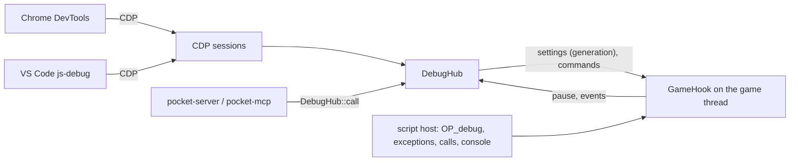

# The script debugger

Status: Built, slice 1 (2026-10-04); served by `pocket serve` and driven by the editor (8, 11).
Code: `crates/pocket-debug`, `crates/pocket-script/src/debug.rs`, `third_party/patches/p9-*.diff`,
`p10-*.diff` and `p11-*.diff`.

Charter: 2 (agent as debugger), 4.2 (QuickJS-ng with PR #1421), 4.3 (one debugging core, three
frontends; instrumentation only while a client is attached), 5.2 (a pause blocks only the game
thread). Related: [script-host.md](script-host.md) 13 (the hooks), [threads.md](threads.md) 3.5 (stalls
and the debugger), [host-protocol.md](host-protocol.md) 6 (the `debug.*` methods), the spike report
[../spikes/debugger.md](../spikes/debugger.md).

This file says how the debugger is built, what each frontend sees, what it costs, how a game wires
it in, how to attach, and how it was verified against real clients.

## 1. Shape

One core, three frontends:

| Part | Where | Thread |
|---|---|---|
| The hooks: instrumentation on and off, trace calls, system calls, console lines, evaluation guard, data-breakpoint probe | `pocket_script::debug` | game |
| The core: `DebugHub` (clients, breakpoints, watches, scripts, the pause, events) | `pocket_debug::hub` | any (`Send + Sync`) |
| The hook the host calls (`GameHook`): stops, steps, serves requests while stopped | `pocket_debug::game`, `inspect` | game |
| Chrome DevTools Protocol endpoint, `ws://127.0.0.1:9229/devtools/game` | `pocket_debug::cdp` | one listener, one per session |
| The agents' JSON API: `DebugHub::call("debug.*", params)` | `pocket_debug::agent` | the caller's |



Frontends never touch the JavaScript context. They edit the hub (breakpoints, watches, modes) and
bump its generation; the game thread's hook rereads a snapshot of the settings when the generation
changes. While the game is stopped, frontends send `Command`s (resume, step, evaluate, properties,
`callFunctionOn`, `setVariableValue`) through a channel and wait for the answer; the hook serves them
from inside the trace call that stopped the thread. Rendering, the servers and every other thread go
on; the game loop shows the state `Breakpoint` (threads.md 3.5) and its commands wait for the resume.

## 2. Instrumentation

quickjs-ng PR #1421 emits `OP_debug` at statement boundaries only in code compiled while a trace
handler is set on the context, and calls the handler at each one while it is set. So:

- `ScriptHost::instantiate` asks the attached hook `instrument()`; if yes it installs the handler
  after the lockdown and before the modules compile, and leaves it installed. The prelude (`pocket`)
  is compiled without it: the debugger stops and steps in project code only.
- `script.update` asks again at the start of every tick and, when the answer differs from the
  installed program's, instantiates the same compiled set again. Programs hold no state and no script
  of the tick has run yet, so this is the boundary reload of script-host.md 13; a program that loaded
  once does not fail to load again, and if it did the old one stays.
- `instrument()` is true while any frontend is attached: a CDP session that sent `Debugger.enable`,
  or agents after `debug.attach`, a breakpoint, a watch or a pause request. The last one leaving
  (a closed socket, `debug.detach`) resumes a pause and drops its breakpoints and watches.
- Uninstrumented, a program is the stock engine's bytecode and the debugger costs nothing (10).

The vendored QuickJS-ng carries two more patches for the debugger:

- **P9** (`p9-debug-line-cache.diff`): each traced function builds a table of its statement
  positions on its first trace, so `OP_debug` no longer searches the function's line table from its
  start at every statement (the spike measured that search as about 90 percent of the instrumented
  cost). The spike's other remedy, line and column as `OP_debug` operands with the opcodes moved
  before the temporary block, renumbers `nop` and the short opcodes, which breaks the precompiled
  builtin bytecode QuickJS-ng embeds (`builtin-array-fromasync.h`, the `Iterator.zip` helpers): the
  wasm workload test aborted in `JS_FreeRuntime`. The cache keeps the bytecode format.
- **P11** (`p11-debug-eval-scope.diff`, Pioneer 2026-10-09): an evaluation in a frame resolves names
  in the lexical scope of the statement the frame stands at. PR #1421 started from the first
  variable of the function's deepest block, so at the debug evaluation's helm.ts:67 an evaluation
  saw `dx` and not `dz` or `bearing`, declared after it in the same block, and anywhere it could see
  a sibling block's locals. While a trace handler is set the compiler emits a temporary opcode
  before each statement opcode, holding the last lexical variable declared so far in its scope
  chain (what a direct `eval` there would see); phase 3 moves it into a per-function table of
  (offset, scope) and adjusts it when jumps shrink; `OP_debug` stores the frame's statement PC
  beside P10's stack pointer, and `JS_EvalInStackFrame` looks the scope up there. Being temporary,
  the opcode renumbers nothing the final bytecode keeps (P9's constraint); the first attempt, a
  `u16` operand on `OP_debug` itself, failed: the compiler's passes read phase 1 and 2 bytecode
  through `opcode_info[op]`, which for the opcodes after the short ones (`OP_debug` is the last)
  is another opcode's entry, so the operand was read as code (`invalid opcode` at load).
- **P10** (`p10-debug-exceptions-frames.diff`): the handler also hears catchable exceptions, once per
  throw, in the throwing frame (flag `JS_DEBUG_TRACE_EXCEPTION`), with a catch prediction
  (`JS_DEBUG_TRACE_EXCEPTION_CAUGHT`): a catch offset on the throwing frame's stack or on an
  instrumented caller's stack as it stood at its current statement (`OP_debug` records each frame's
  stack pointer in `JSStackFrame.debug_sp`). `JS_GetDebugTraceException` gives the exception during
  that call. `JS_GetStackFrameInfo(level)` gives any frame's module, function name (as backtraces
  name it) and position, which replaces the spike's parsing of `Error().stack`.

## 3. What stops the game

At each traced statement of a project module the hook checks, in order:

1. A pause request (`Debugger.pause`, `debug.pause`): stop here.
2. A `debugger;` statement, while a frontend is attached.
3. Data breakpoints (6): the first whose staged value changed since the last statement.
4. A step (5).
5. Breakpoints on this generated line, the first statement of the line only (the line visited
   again by a statement on the same line does not stop twice). A condition is evaluated in the
   frame and stops only when truthy (an exception counts as false); a logpoint (an agent's `log`
   template) is logged and never stops. DevTools' and js-debug's logpoints are conditions that call
   `console.log` and return `false`, which this serves as is.

Exceptions: with `uncaught` the game stops where an exception no `try` catches is thrown, with `all`
at every throw; never on the budget's or memory's uncatchable errors, never twice on one exception
value (a rethrow by the prelude's `each`, which wraps callbacks). The prediction is P10's: a
`finally` counts as a catch, and frames that never ran an `OP_debug` (the prelude, natives) count
as not catching. An exception that escapes a system also reaches every frontend as an event
(`Runtime.exceptionThrown`, and the `log` topic) whatever the mode.

When nothing stops it, a statement costs the hook a few loads and compares; with no breakpoint, no
watch and no step it returns after two (10).

## 4. Scripts, source maps and positions

QuickJS-ng runs each module's JavaScript under its module path (`scripts/rules.ts`). A CDP client
sees it as:

- `Debugger.scriptParsed` with `url: "pocket:///scripts/rules.js"`, a stable `scriptId` per module
  and JavaScript (a hot update that changes the module announces a new one with the same URL), and
  `sourceMapURL`: a `data:application/json;base64,...` URL of oxc's map rewritten so that its one
  source is `rules.ts` (beside the script, so `pocket:///scripts/rules.ts`) with the TypeScript text
  in `sourcesContent`. `HubOptions::source_root = SourceRoot::Project(dir)` writes absolute
  `file://` sources instead, for editors that should open the files without a path override.
- `Debugger.getScriptSource` returns the JavaScript, and every position on the wire is the
  JavaScript's, 0-based. Clients map to TypeScript themselves; breakpoints arrive as JavaScript lines
  (`setBreakpointByUrl` with `url`, `urlRegex` or `scriptHash`, or `setBreakpoint` by script).
  `getPossibleBreakpoints` lists the lines with mappings and their first mapped column.
- Call frames are the project's bytecode frames, innermost first; native frames and the prelude's
  are left out (V8 leaves out natives), their levels kept as `callFrameId`. Each has three scopes:
  `local` (arguments and locals, a block's not yet entered shown `undefined`), `closure` and
  `global`. Properties are read from descriptors: no getter or Proxy trap runs; accessors are listed
  as `get`/`set`. Objects carry a short `preview`.

Agents speak TypeScript: `{file: "scripts/rules.ts", line: 27, column: 13}`, 1-based, the module path
as `scripts.list` names it. A breakpoint on a line without code moves to the next line with code
(as V8 moves one), and is set on every generated line mapped from that TypeScript line. Generated
code no TypeScript wrote (the harden epilogue) is reported with `generated: true` and stepped
through.

## 5. Pause, inspection, steps

A pause runs inside the trace call, on the game thread: the handler is cleared (nothing the debugger
runs is traced), stale commands are dropped, the frames and their scopes are captured, the pause is
published (`Debugger.paused`, the `debug` event, `debug.state`) and the loop state set to
`Breakpoint`; then the thread serves commands until a resume or a step. Values handed out as
`objectId`s (`p<pause>:o<n>`) live until the pause ends.

Evaluation (`evaluateOnCallFrame`, `debug.eval`, conditions, logpoint messages) uses PR #1421's
`JS_EvalInStackFrame`: the expression sees the frame's arguments, locals and closure variables (the
system's `ctx` included); with P11, the block-scoped locals are those in scope at the frame's
statement (every `let` and `const` declared before it in its block and the enclosing ones), in the
stopped frame and in callers', and not a sibling block's. It runs under
`pocket_script::debug::guarded`: its own budget of `steps_per_call`, the stopped call's budget,
overrun flag and out-of-memory baseline put back after it, and the natives that write (world edits, events, intents, random draws, `Math.random`)
refusing with `script.debug_read_only`. It can still change the call's locals and its query
columns, which are written back, so an evaluation, a condition, a logpoint message or a variable
set inside a system call taints the run from that tick (script-host.md 13): the game's recorder
writes `Tainted {tick, reason}` (replay.md 2.2, where `verify` stops) and `status` shows `tainted`.
Property listings and `callFunctionOn` previews do not taint.

Steps compare frame depth (native frames included) and the generated line: *over* stops at the
next statement in this frame or a shallower one on another line; *into* at the next statement in
another frame or on another line; *out* at the next statement in a shallower frame. A step that
leaves the system's `run` stops at the next statement anywhere, normally the next system's first, so
stepping walks through the tick.

## 6. Data breakpoints

`debug.watch {entity, component, field?}` stops when a script system's *staged* write changes the
field: the value the entity's component would get if the call committed now, read at every
statement by `pocket_script::debug::FieldWatch`: the world as the call began, the query columns the
call changed (their typed arrays, compared bit for bit), then its own commands (`world.set`,
`insert`, `remove`, `despawn`), as the commit applies them. The pause names the watch, the values
before and after (each slot of a vector field), and `written_at`, the statement traced before the
change was seen: the one that wrote, since a write is seen at the next statement boundary. A write
by the system's last statement is seen when `run` returns: the pause then has one frame, marked
`returned`, at `written_at`, and nothing to evaluate in (`after_return: true`).

Watches are agent-native; a CDP client attached at the same time sees the pause (reason `other`,
`data.pocket = "data_breakpoint"`). While one is set every statement pays its probe (10).

## 7. The agents' API

`DebugHub::call(method, &params) -> Result<serde_json::Value, pocket_contract::Problem>`;
`pocket_debug::methods()` lists each method with its catalog kind (`read`, `control`, `write`),
aliases, doc and parameters' JSON Schema; `pocket serve` puts them in the command catalog
(server.md 6), so `pocket help debug.eval` and the MCP `debug` tool's input schema name every
parameter. Unknown parameters are refused (`request.unknown_field` with suggestions), unknown
methods with `request.unknown_method`. Aliases: `debug.break` (`debug.breakpoints.set`),
`debug.watch.clear` (`debug.unwatch`). A `file` may be the module's path, an absolute path ending
with it, or its end when only one module ends so (`helm.ts`).

| Method | Params | Result |
|---|---|---|
| `debug.attach` | `{}` | state; scripts instrumented from the next tick |
| `debug.detach` | `{}` | state; the agents' breakpoints and watches go, a pause resumes when no CDP client is attached |
| `debug.breakpoints.set` | `{file, line, condition?, log?}` | `{id, file, line, verified, locations}` (the line it moved to) |
| `debug.breakpoints.clear` | `{id?}` | `{cleared}`; every agents' breakpoint without `id` |
| `debug.breakpoints.list` | `{}` | every breakpoint, the CDP clients' too, with owner and locations |
| `debug.pause` | `{timeout_ms?}` | state, after waiting up to `timeout_ms` for the stop |
| `debug.continue` | `{}` | `{state: "running"}` once the thread left the pause; also releases a game held for a debugger |
| `debug.step` | `{kind: "over"\|"into"\|"out", timeout_ms?}` | state at the stop (default wait 5 s) |
| `debug.state` | `{brief?}` | `{state, reason, tick, system, location, frames: [{frame, function, location, locals, closure, returned}], hit_breakpoints, exception?, data?, attached, instrumented, exceptions, breakpoints, watches, waiting_for_debugger, cdp}`; a local is `{name, type, value, description?}` (`value` a JSON preview, `description` an object's, such as `Float64Array(1)`); `cdp` is `{ws, devtools}` while the hub serves CDP, else `null`. `brief`: the innermost frame's locals without `ctx`, the other frames as `{frame, function, location}`, breakpoints as `{id, at, condition, log}`, no closures and no CDP (660 bytes where the full state is several kilobytes) |
| `debug.eval` | `{expr, frame?}` | `{type, value, description}` (`value` JSON, integers as integers). An assignment to a variable (`r = 7`) stays in the evaluation: QuickJS-ng hands an evaluation a copy of each local no closure captured. One through an object (`g.level[r] = 7`, a query column) writes the object |
| `debug.set` | `{name, value, frame?}` | `{type, value, description}`: `value` (an expression) evaluated in the frame and assigned to its argument, local or closure variable `name` (`JS_SetVariableAtLevel`, as CDP's `Debugger.setVariableValue`); a `const` refuses, and a name declared in two block scopes of one function sets the first declaration |
| `debug.watch` | `{entity, component, field?}` | `{id, entity, component, field}`; `entity` an id, or a name or `Name#id` that the host resolves in the last publication (the hub alone refuses a name) |
| `debug.unwatch` | `{id?}` | `{cleared}` |
| `debug.exceptions` | `{mode: "none"\|"uncaught"\|"all"}` | `{mode}` |
| `debug.wait` | `{timeout_ms?}` | state, once stopped or after the wait |
| `debug.rewind` | `{tick, bundle?}` | `{restored, tick, scripts, stopped_by?}`: served by the host's server, not the hub: `snapshots.restore` at or before `tick` (under the applied scripts unless `bundle: "snapshot"`), then `time.step` to it (server.md 3.3); the hub alone answers `debug.unsupported` |

Problems: `debug.not_paused`, `debug.no_frame`, `debug.eval_failed {error}`, `debug.set_failed
{name}` (a constant, no such variable, the expression threw, a returned frame), `debug.unknown_file
{suggestions, allowed}`, `debug.no_code`, `debug.unknown_breakpoint`, `debug.unknown_watch`,
`debug.unsupported`; an evaluation that calls a writing native fails with `script.debug_read_only`.
The `debug` family is not yet a row of shared/contract/errors.md's family table; changes to that
table update the contract record in this repository.

`DebugHub::subscribe()` gives `DebugEvent`s; `DebugEvent::json()` is the host protocol's pushed event
(host-protocol.md 3): `{"event": "debug", "data": <state as debug.state>}` on a pause,
`{"event": "debug", "data": {"state": "running"}}` on a resume, `{"event": "log", "data": {level,
source: "script", message, tick, system, file?, line?, column?}}` for a console line or a logpoint,
and the same with `code` for a system that failed.

## 8. Wiring a game

```rust
use pocket_debug::{CdpOptions, DebugHub, HubOptions};

// Once per game, on any thread.
let hub = DebugHub::new(HubOptions { title: "Amoris: sailing".into(), ..HubOptions::default() });
let cdp = hub.serve_cdp(CdpOptions::default())?;          // 127.0.0.1:9229, its own threads

// The game thread's setup (pocket_runtime::thread::GameThread::spawn's closure).
let h = hub.clone();
let handle = GameThread::spawn(move || {
    let mut game = Game::new(setup, seed)?;
    game.set_script_debugger(Some(h.hook()));             // must run on the game thread
    Ok(game)
}, options)?;
hub.set_loop_state(handle.loop_state());                  // pauses show as LoopState::Breakpoint

// The server: agents' calls and events.
let result = hub.call("debug.breakpoints.set", &json!({"file": "scripts/rules.ts", "line": 27}));
let events = hub.subscribe();                             // DebugEvent::json() -> debug / log topics

// Shutting down: resume a pause first, or the game thread cannot reach its boundary.
hub.shutdown();
handle.shutdown(2000)?;
cdp.stop();
```

- One hub per game. `hook()` replaces the previous hook's command channel; `Game::fork` and a replay
  do not carry the hook. The game thread's Play is the exception (`pocket_runtime::thread`,
  `play.start`): the edit world's hook moves to Play's fork, which instruments its program from its
  first tick, and back to the edit world on Stop, so breakpoints set in Edit hit in Play.
- `hub.wait_for_debugger(timeout)` holds the caller until a client sends
  `Runtime.runIfWaitingForDebugger` or an agent `debug.continue` (the `--inspect-brk` model); call
  it before starting real time.
- While paused, the game thread answers no command (threads.md 3.5). The hub's `debug.*` answers,
  and what presenters read from the snapshot reader stays current: the pushed `status`
  (`state: "breakpoint"`), the render feed, events and logs. A pause records its summary in the
  loop state (`StateHandle::stopped`, `Pause::summary`: `{reason, tick, system, location,
  breakpoint?, watch?, exception?}`), and the host's server uses it so that no caller waits
  (server.md 3.4, 2026-10-09): a `time.step` the pause interrupts answers at once with it as
  `stopped_by` and ends with the stopped tick; `status`, `world.get/tree/query/schema` and
  `scripts.list/read/status` answer from the last publication and the files; every other call
  that needs the game thread is refused at once with `debug.paused`. A client that stops Play while
  paused continues the pause first (the editor does, editor.md 8.1).
- `pocket serve` (pocket-app `serve.rs`) does the above for every served project: one hub, CDP on
  127.0.0.1:9229 when the port is free (otherwise a line on stderr, and `debug.*` still works), the
  hook on the game thread, the loop state, `DebugBridge` as the server's `debug.*` plug-in (its
  calls and its methods; the server adds `debug.rewind`), and a thread forwarding
  `DebugEvent::json()` to the `debug` and `log` topics.
  There is no `--inspect-brk` wait. The editor's Debug panel drives the hub through `debug.*` over
  the host's `/ws` (editor.md 8.1); CDP stays on its own port.

## 9. Attaching

Run the sailing sample in real time with the endpoint on:

```sh
cargo run -p pocket-app --example debug_sailing -- [--port 9229] [--wait] [--speed 1] [--file-sources]
```

It prints `{"ws": "ws://127.0.0.1:9229/devtools/game", "devtools": "devtools://devtools/...", ...}` and
then a status line a second (`tick`, `paused_in_debugger`, `loop_state`).

- **Chrome DevTools**: open the printed `devtools://devtools/bundled/js_app.html?...&ws=127.0.0.1:9229/devtools/game`
  in Chrome (or `chrome://inspect`, Configure, add `127.0.0.1:9229`, then inspect the
  `pocket-game` target; this route was not exercised by the harness of 11, which opens the same
  frontend page directly). Sources shows `pocket://scripts/*.ts` from the source maps; click a line
  number to break.
- **VS Code**: copy `editors/vscode/launch.json` to `.vscode/launch.json` and run "Attach to
  Amoris (sailing)". It is a `node` attach on 9229 with `sourceMaps`, `resolveSourceMapLocations:
  null` (the scripts are not files) and `sourceMapPathOverrides: {"pocket:///*":
  "${workspaceFolder}/samples/sailing/*"}`, so breakpoints set in `samples/sailing/scripts/*.ts` bind.
  See `editors/vscode/README.md`.
- **Agents**: through pocket-server or pocket-mcp, the methods of 7.
- **The editor**: `pocket serve <project>` serves it; its Debug panel and the Scripts panel's gutter
  use the methods of 7 over `/ws` (editor.md 8.1, evidence in editor.md 10).

## 10. Cost

The script host's web workload (40 boats, 160 crates, 7 systems; 10,713 traced statements a tick) as
a game; every mode's game stepped in turn, tick by tick, on one thread asking for a performance
core, timing the thread's CPU; three processes per build, alternating builds; medians.
`cargo run --release -p pocket-app --example debug_overhead`; raw figures in
[../evidence/debug/overhead.txt](../evidence/debug/overhead.txt). Apple M5 (Mac17,2), macOS 27.0.1,
2026-10-04, other agents' builds running (load average 13 to 23).

| Mode | With P9 (shipped) | Versus none | Without P9 (the PR's line search) | Versus none |
|---|---|---|---|---|
| none: no debugger attached | 1,101.8 us | 1.000 | 1,070.3 us | 1.000 |
| detached: a hub attached, no frontend (uninstrumented) | 1,086.1 us | 0.987 | 1,056.3 us | 0.992 |
| attached: a frontend, no breakpoint (every statement traced) | 1,141.6 us | 1.046 (4.3 ns a statement) | 1,242.7 us | 1.161 (15.8 ns) |
| armed: a conditional breakpoint on a line no tick runs | 1,232.6 us | 1.146 (15.0 ns) | 1,332.1 us | 1.239 (22.9 ns) |
| watch: a data breakpoint probed at every statement, never hit | 4,788.8 us | 4.412 (352 ns) | 4,803.5 us | 4.538 |

Detached costs nothing (the bytecode is the stock engine's). Attached costs 5 percent with P9 and
16 without; the spike measured 2.04 times for the PR's handler before its own fast path. A breakpoint
anywhere puts every statement through the full check (15 percent). A data breakpoint costs 4.4 times
while set: it reads the call's staged state at every statement (6). A pause costs nothing per
statement; the first pause after `runIfWaitingForDebugger` came 25 ms later on a debug build, a step
over round trip 5 ms.

## 11. Verification

| Check | What | Result (2026-10-04) | Evidence |
|---|---|---|---|
| `cargo test -p pocket-app --test debug_agent` | The agents' API on a real game thread, real time, the test project `crates/pocket-debug/tests/fixtures/debugme`: `debugger;`, uncaught and caught exceptions with the prediction, a conditional TypeScript breakpoint with locals and evaluation, read-only evaluations, `debug.set` on a `let` local (the loop's `r`, seen by the caller's frame of the next pause and set back there with `frame: 1`) and on an argument (`twice`'s `x`, whose call then returns twice the new value), a `const` refused, step into/out/over, a data breakpoint with `written_at`, the taint, a hot update while attached (new script announced, its breakpoint stops), pause, detach (uninstrumented), events, problems, the `Breakpoint` loop state | pass | [agent-api-test.txt](../evidence/debug/agent-api-test.txt) |
| `cargo test -p pocket-app --test debug_agent` (`play_takes_the_debugger_to_its_fork`, `debug_state_names_the_cdp_endpoint`) | `play.start` on a game thread started paused (as `pocket serve` starts it): a breakpoint set in Edit stops Play's fork at its first tick, an evaluation that assigns a query column (`g.level[r] = 100`) is committed, `play.stop` hands the hook back and a `time.step` of the edit world stops at a new breakpoint; `debug.state`'s `cdp` names an endpoint served on port 0 and is `null` once it stopped | pass (3 of 3 with the test above; `--release`) | the test's output |
| `cargo test -p pocket-app --test debug_agent` (`eval_sees_the_block_scoped_locals_in_scope`, 2026-10-09, Windows) | **P11** on the test project `crates/pocket-debug/tests/fixtures/scopes`: in a called function its local and arguments, in the caller's frame the block's locals declared before the call and not one declared after it; after a sibling block, the block's `dx`, `dz`, `bearing` and the module's `GAIN`, not the sibling's `hidden`; the debug evaluation's helm.ts:67 shape (three consts in the deepest block) with all three. Without P11's lookup the run fails at `hidden` (the control was run) | pass; `node crates/pocket-debug/tests/cdp_e2e.mjs` 20/20 on the same build ([cdp-e2e-p11.txt](../evidence/agentdebug/cdp-e2e-p11.txt)) | the test's output |
| `cargo test -p pocket-app --test paused_host` (2026-10-09, Windows) | **A held host** through `pocket_server::Host::call` over the test project on a game thread started as `pocket serve` starts it: the catalog's entry of every method (kind, schema), a breakpoint by the module's short name, a `time.step {ticks: 5}` answered at the stop (`stopped_by` breakpoint, tick 4, `paused: true`) and ended with that tick, `status` and seven reads equal to the game's own reads of the same world, `scripts.apply`, `time.step`, `snapshots.list`, `history.list` and `world.edit` refused with `debug.paused` within 500 ms, `debug.watch` by name (a misspelt name refused with the suggestion), `debug.state {brief}`, a data watch stopping a step, `debug.rewind` under the applied scripts; and the MCP `debug` tool naming every method and parameter | pass | the test's output; [smoke-server.txt](../evidence/agentdebug/smoke-server.txt) does the same through the CLI and MCP |
| `editor/tools/debug-host.ts` | **The editor** (built, served by `pocket serve` on a copy of the sailing sample) in headless Chrome, real input only: a gutter breakpoint, Play, the pause with the call stack, scopes and watches, step over, a column value set in the Variables tree and committed, an argument set with `debug.set` and a `const` refused, a data breakpoint from the inspector, pause on exceptions, a script edited and hot-swapped while running and a breakpoint in the new code, Stop while paused (the edit world takes the edited scripts) and Play again into the new code (editor.md 10) | every step (12 views) | [debug-host.txt](../evidence/editor/debug-host.txt), `debug-host-*.png` |
| `node crates/pocket-debug/tests/cdp_e2e.mjs` | A CDP client as clients behave: discovery as js-debug does it, Origin refusal, `scriptParsed` and the data-URL map, a breakpoint on a TypeScript line mapped through the map, the pause at that line with the caller `run`, locals, closure, `evaluateOnCallFrame` on two frames, `getProperties`, step over, a conditional breakpoint, a logpoint (`consoleAPICalled` located in rules.js, no pause), `Debugger.pause`, leaving while paused resumes | 20/20 | [cdp-e2e.txt](../evidence/debug/cdp-e2e.txt), [messages](../evidence/debug/cdp-e2e-messages.log) |
| `node crates/pocket-debug/tests/jsdebug_dap.mjs` | **VS Code's js-debug 1.140.0** as installed in `/Applications/Visual Studio Code.app` (its extension bundle loaded under a stand-in for the `vscode` module, since the app ships no standalone DAP server), resolving `editors/vscode/launch.json` through its own configuration provider and spoken to over DAP as VS Code does (root session, then the child session it starts for the target): a breakpoint set by the `.ts` path verifies, `stopped` at rules.ts:27 on disk, the caller `run` at 26, Local `r = 0`, `e`, Closure `b`, `l`, `ctx` and `ctx` expanded, a REPL evaluation, a hover (`Float64Array(1) [0.0]`), `next` to line 28, disconnect leaves the game running | 13/13 | [jsdebug-dap.txt](../evidence/debug/jsdebug-dap.txt), [DAP](../evidence/debug/jsdebug-dap-messages.log), [CDP it sent](../evidence/debug/jsdebug-cdp.log) |
| `node crates/pocket-debug/tests/devtools_chrome.mjs` | **Chrome DevTools** (the frontend Google Chrome 154 serves at `/devtools/js_app.html`, the page `chrome://inspect` opens for a Node target) in a headless Chrome against the endpoint, worked through its own modules: the workspace holds `pocket:///scripts/{main,components,rules}.ts` with the TypeScript text, `BreakpointManager.setBreakpoint` on rules.ts:27 pauses there with the call stack and the Scope pane, console evaluation, step over to 28, resume | 8/8 | [devtools-chrome.txt](../evidence/debug/devtools-chrome.txt), [screenshot paused](../evidence/debug/devtools-paused.png), [stepped](../evidence/debug/devtools-stepped.png), [CDP it sent](../evidence/debug/devtools-cdp.log) |

The harnesses start `debug_sailing` (default `$CARGO_TARGET_DIR/debug/examples/debug_sailing`, `--exe`
to change) and stop it; `POCKET_CDP_LOG=1` logs every CDP message on its stderr (`--game-log FILE`).

## 12. Limits and open items

- **Web**: the trace hook builds and runs in `wasm32`; a page cannot listen on a port, so the web
  build needs a relay (the page, or the host's server) to carry CDP. Not built.
- **`debug.rewind`** is the host's (7): it restores the kept snapshot at or before the tick (one
  every 60 ticks, the last 120) and steps forward to it. The commands applied between the snapshot
  and the tick are not recorded, so a rewind past an edit lands on a world without it (server.md 11);
  a breakpoint on the way stops the replay like any tick.
- **Catch prediction**: a `finally` counts as a catch; a `catch` in the prelude or a native is not
  seen (the prelude's only one, in `each`, rethrows).
- **Callers' positions** are those of their calls (QuickJS-ng's `cur_pc`), so a caller stopped in a
  multi-line call shows the call's line.
- **Locals** of blocks not yet entered show `undefined` (QuickJS-ng lists every variable of a
  function).
- **DevTools' call stack** names the frame of a method such as `run(ctx, q) {}` "(anonymous)",
  though CDP gives `functionName: "run"` (VS Code shows `run`); DevTools resolves names through the
  source map, whose oxc mappings have no name for the method key.
- **js-debug's attach-time evaluations** (process and WebAssembly probes) are answered `undefined`
  while the game runs: the game thread evaluates nothing outside a pause.
- **Data breakpoints** watch one entity's component field; strings compare by text; the cost is
  4.4 times while set (10). A probe that keeps column pointers could cut it.
- **One game per hub**; several CDP clients may attach at once and share one pause.
