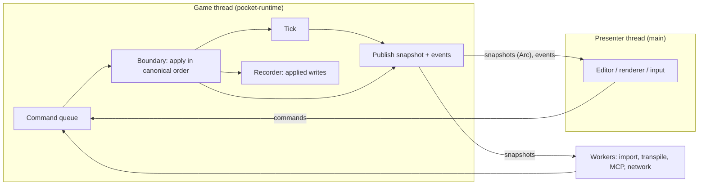

# Threads: the game and the editor

Status: Draft, slice 0

Charter: 5.1 (the game and the editor on two threads), 7 item 15 (snapshot publication, the command
queue and its ordering against agents' actions, the web form), 4.1 (threads row), 3.3 and 3.5
(determinism and the time model the threads must not disturb), 12 item 8 (the web form, open).

This specification fixes how the game thread and the presenter thread share nothing but immutable
snapshots and a command queue: the snapshot's contents and when it is published, the command
envelope, the order in which commands from the editor, agents, players and the engine itself reach
the world, the work done off both threads, the browser form as a Web Worker, failure, and the run
forms built on it. The crates named here are those of `architecture.md`. The threads spike
(`docs/spikes/threads.md`) measured this design; its numbers are section 12 and set the thread
budgets of `budgets.md`.

Concepts used by name and owned elsewhere: Tick, boundaries and boundary writes, `Sim`, events and
`EventSeq` (spec-sim, [simulation.md](simulation.md)); the canonical encoding, `Snapshot`,
`SectionKey`, the world hash, fork, the `Recorder` and replay (spec-persist,
[persistence.md](persistence.md), [versions.md](versions.md)); hot update, bundles and the script
host (spec-script, [script-host.md](script-host.md), [hot-update.md](hot-update.md)); time modes,
pause-on-decision, the time controller, seats and their order, actions and the error protocol
`{code, message, detail}` with its type `Problem` (spec-contract,
[time.md](../../shared/contract/time.md), [actions.md](../../shared/contract/actions.md),
[errors.md](../../shared/contract/errors.md)); MCP sessions and tools (spec-mcp,
[mcp.md](../../shared/contract/mcp.md)).

## 1. Why two threads, and which

Master ran the editor, the scripts and the simulation in one runtime on one thread
(`docs/editor.md`: the editor "runs beside the project in the same runtime"), so whatever stalled
one stalled all: a 5M-triangle import held a `state` call for 4.7 s
(`docs/research/2026-10-02-rendering-and-import-assessment.md`, item 3), and in a paused session
"`frame()` still ticks" (`docs/development.md`, Tests). The rebuild splits ownership:

- **The game thread** owns the world, the script host, physics, the time model and the recorder. It
  alone mutates state and steps the tick (charter 5.1).
- **The presenter thread** is the process's main thread: the editor (`egui`) and the human view in
  an editing session, the window, renderer and audio in a shipped game. The charter's "editor
  thread" is this thread. It is the main thread because windowing requires it on some platforms
  (`winit` creates its event loop on the main thread, as macOS demands) and because a shipped game
  keeps the same split (charter 5.1: "the game thread simulates, the main thread presents").
- **Worker threads** (asset import, transpiling, hot-update trials, throwaway forks, MCP and network
  I/O, the debugger's endpoint) own no world state they share: a fork a worker steps is its own
  value. They talk to the game thread only through the command queue (section 6).



## 2. Vocabulary

- **Boundary n** (simulation.md 2): the moment between tick n and tick n+1, while the world shows
  state n. Every change to the world from outside a tick is a boundary write applied at a boundary
  (charter 5.1; simulation.md 4.2). The writes applied at boundary n-1 are the inputs of tick n.
- **State `(tick, writes)`**: the world after tick `tick` and the first `writes` writes of boundary
  `tick`, the name simulation.md 4.2 recommends and persistence.md's `SnapshotHeader` carries;
  `(n, 0)` is the state tick n left.
- **Batch**: the commands applied at one boundary.
- **Write**: a command that may change the world. **Read**: a command that never does. **Control**:
  a command that changes when ticks run but not what they compute (spec-contract decides which
  commands are which; a control command whose effect is visible in the world is a Write; `step`,
  `commit`, `wait`, `continue`, `pause` and `resume` are Controls). **Request**: a command the
  runtime routes to a worker (a hot update's stages, an import), answered when the worker is done;
  it is never recorded, and the Host Write it produces is (5.5).
- **Publication**: the game thread replacing the latest snapshot with a new one.

## 3. The game thread

### 3.1 Ownership

`pocket-runtime`'s `Game` value holds the worlds (main and its branches, 3.6), the script host,
physics, the interface state and the recorders; it is driven synchronously (`apply`, `step`,
`snapshot`). The script host cannot cross threads: rquickjs 0.14.0 implements `Send` for its
`Runtime` and `Context` only under its `parallel` feature (rquickjs-core 0.14.0
`src/runtime/base.rs` and `src/context/base.rs`), which enables `tokio/rt-multi-thread`, and tokio
is forbidden in the game group (architecture.md 6). So the `Game` is built on its own thread:

```rust
// pocket-runtime (native, feature `thread`)
pub struct ThreadOptions {
    pub stack_bytes: usize,                       // script-sandbox.md 4.3: from the depth test
    pub clock: Arc<dyn Fn() -> f64 + Send + Sync>, // milliseconds, monotonic; the loop's clock
    pub on_publish: Arc<dyn Fn() + Send + Sync>,  // 4.3
}
impl GameThread {
    /// Builds the Game with `make` on a new thread named `pocket-game`, whose stack is
    /// `options.stack_bytes`, through `std::thread::Builder::stack_size`.
    pub fn spawn(make: impl FnOnce() -> Result<Game, Problem> + Send + 'static,
                 options: ThreadOptions) -> Result<GameHandle, Problem>;
}
```

Every thread that runs scripts builds its own `ScriptHost` from a `CompiledSet` (script-host.md 9):
the game thread inside `make`, and each runtime worker (section 6). Nothing else holds a reference
into the `Game`. The headless batch form and every check drive `Game` directly without a thread
(section 9), so the thread wrapper adds no behavior the checks miss except what section 11 tests
separately.

The `Game` reads no clock of its own: `Instant::now` panics on `wasm32-unknown-unknown`, and the
game-group crates may not depend on `js-sys` (architecture.md 6). The caller injects one, as
`ThreadOptions::clock` natively (an `Instant` from the game's start) and from `pocket-web`, which
may use `js-sys`, in the worker (`performance.now()`); `Game::new` takes the same
`Arc<dyn Fn() -> f64 + Send + Sync>`, and so does `pocket_check::measure` (budgets.md 7.1). The
loop's pacing, `published_at_ms`, `UpdateReport.timings` and the `StepHooks` that time systems all
read it.

### 3.2 The loop

```text
loop {
    batch  = drain the queue (blocking as `pace` says) + held commands due at this boundary
    sort batch by (source, seq)                                    // 5.2
    for each command: apply; reply now or defer                    // 5.4
    pace = time_model.pace(now)                                    // 3.3
    if a Write succeeded and pace is not RunTick:
        publish state (tick, writes so far)                        // 4.3
    match pace {
        RunTick          => run one tick; record; publish state (tick + 1, 0)
        WaitUntil(t)     => block on the queue until t or a command
        WaitForCommand   => block on the queue until a command
        Quit             => leave the loop                         // 8
    }
}
```

The wall clock (`now`) is read here, by the loop, and passed to the time model's pacing question; it
never reaches a system inside the tick (spec-sim forbids it; `checks.md`, clippy, enforces it in the
game-side crates). A command that wakes the loop is applied at once, at the boundary the world is
at, before the deadline: the threads spike measured 1.0 to 1.6 ms from a command to its visible
effect this way at 60 Hz, against 8.7 to 9.5 ms at the median (17.8 ms worst) when commands wait for
the next tick (`docs/spikes/threads.md`, Native: command to visible).

`WaitUntil` must wake within about a millisecond of its deadline. On Windows `std`'s `recv_timeout`
and `park_timeout` do not: in the threads spike a 1 ms `recv_timeout` took 13.85 ms at the median
and a 10 ms one 21.27 ms, while `thread::sleep(1 ms)` took 1.54 ms (max 1.79). The native loop
therefore waits in `thread::sleep` slices of at most 1 ms and drains the queue between them (the
spike's tick start intervals: p50 16.66 ms, p99 17.4 ms, max 17.6 ms at 60 Hz), or calls
`timeBeginPeriod(1)` while real time runs and `timeEndPeriod(1)` when it stops (no rights needed; 1
ms waits then took 1.39 ms at the median). `WaitForCommand` blocks on the queue with no timeout
precision needed.

### 3.3 Pace and real time

`Pace` is the answer spec-contract's time model gives at each boundary:

```rust
pub enum Pace {
    /// Run the next tick now (stepping, unpaced fast-forward, or real time that is due).
    RunTick,
    /// Real time: the next tick is due at this instant of the loop's monotonic clock.
    WaitUntil(Deadline),
    /// Paused, waiting on a decision (pause-on-decision, turns, lockstep input): only a command
    /// can change the answer.
    WaitForCommand,
    /// Shut down after this boundary.
    Quit,
}
```

In real time the loop keeps an accumulator of due ticks, the established fixed-timestep loop (Glenn
Fiedler, "Fix Your Timestep!", 2004). When ticks take longer than the timestep the game falls
behind: the loop runs at most 5 ticks (chosen; not measured in slice 0) before the next boundary's
publication and then drops the excess wall time, so the game slows down instead of spiralling. The
world is unaffected (the same ticks run in the same order); the snapshot's time status reports
`behind_ms` so the presenter and agents can see it.

### 3.4 Helper threads inside a tick

A tick runs on the game thread alone: `bevy_ecs`'s single-threaded executor, physics without its
`parallel` feature, no thread pool (`architecture.md`, 6). A data-parallel helper MAY be added later
for a system whose items are independent, under the rule master's cloth followed ("each sheet
touches only its own particles ... so the result is the same to the bit whichever thread moved
which", `docs/design/physics.md`, cloth): the helper's specification states the partition, and the
determinism check runs the workload with one worker and with 4 workers and compares hash chains. The
web build has no helper threads, so a helper is only ever a speed-up.

### 3.5 Stalls and the debugger

A tick runs to completion; nothing interrupts it from outside (an interrupted tick would leave a
state no replay reproduces). Runaway scripts are stopped by the execution budget, which counts work
and is deterministic (spec-script, charter 4.2.1). While a tick is long, the presenter keeps drawing
the latest snapshot and reads the game's status:

```rust
pub enum LoopState { Waiting, Applying, Ticking, Breakpoint, Stopped }  // not spec-sim's TickPhase
pub struct GameStatus {
    pub state: LoopState,
    pub tick: Tick,          // the tick running, or the last one that ran
    pub since_ms: f64,       // how long the game has been in `state`, on the loop's clock
}
```

The status is kept in atomics the reader loads without locking; it is presentation data, never part
of the world. When the native debugger (the debugger spike, `docs/spikes/debugger.md`; charter
4.2.6) stops at a breakpoint, the game thread is inside a tick: the state is `Breakpoint`, no
boundary happens, queued commands and agents' steps wait until it resumes, and the editor stays
responsive on its own thread with the last snapshot. The spike pauses on the game thread inside the
trace callback and keeps its protocol server on another thread that only forwards requests, the
split section 6 describes; that thread is `pocket-debug`'s (architecture.md 4.17). The PR's handler
doubled the cost of every statement while installed (2.04 times with no client) and cost nothing
measurable while compiled in and not installed, so scripts are instrumented only while a debugger is
attached, re-instrumented at the start of the next tick (debugger.md 2); with P9 an attached
debugger costs 1.05 times (debugger.md 10). `pocket-debug` sets the state `Breakpoint` through the
handle `GameHandle::loop_state` gives it and `Ticking` when it resumes. An evaluation inside a
paused tick taints the run (script-host.md 13).

### 3.6 Worlds: main and branches

A `Game` holds main and the branches MCP sessions fork from it (shared/contract/mcp.md 5.5), keyed
by `WorldRef` (`main`, `b1`, `b2`, ...); each world has its own bundle binding (versions.md 7.5),
recorder (replay.md 2.5) and pacing (branches are always stepped). A command names its world in its
parameters (`world`, default `main`); the catalog routes it there, and an unknown or foreign world
is `session.unknown_world`.

- **Stepping a branch is a Control.** While main is paused or stepped, a branch's `step` runs on the
game thread between main's boundaries, as any Control does.
- **While main runs in real time**, a branch must not hold main's ticks: the game thread runs at
most one worker slice (8 ms, as 7.3) of branch ticks per boundary of main and then yields to main's
pacing, and the reply comes when the branch's step is done. A branch whose step would take longer
moves to a runtime worker with its own `ScriptHost` built from the branch's `CompiledSet`: the
fork's world moves with it (persistence.md 6.3 yields a world that can move), and later commands to
that branch are routed to the worker. The budget `branch.main_lateness` (budgets.md 5.2) measures
main's tick lateness while a branch steps.
- A branch's ticks never touch main's world, recorder or event stream; a branch publishes no
snapshot unless a presenter asks for it.

## 4. Snapshots

### 4.1 What a snapshot is

A published snapshot is spec-persist's `Snapshot` of the world (persistence.md 4 and 6.1: a header
with `(tick, writes)`, the sections in canonical order each holding its bytes in an `Arc`, and the
world hash) with what a presenter needs beside it (charter 5.1: "the same canonical data the
perception layer and the world hash use").

```rust
// pocket-link
pub struct WorldSnapshot {
    pub version: u64,                // publication counter of this run, from 1
    pub snapshot: Snapshot,          // spec-persist's: header (tick, writes, engine, bundle), sections, world hash
    pub registry: Arc<RegistryInfo>, // component names, versions and JSON Schemas (same Arc until it changes)
    pub time: TimeStatus,            // spec-contract's TimeStatus (time.md, Requests), plus `behind_ms` (3.3)
    pub last_event: u64,             // stream number of the last event emitted up to this state (4.4)
    pub published_at_ms: f64,        // the loop's clock at publication; presentation only, never hashed
}
```

- `(tick, writes)` from the header names a world state within a run; `version` orders publications.
- Natively the snapshot holds every section, caches included (the physics solver's state, which fork
  and the world hash cover, charter 3.3): sharing an `Arc` costs nothing. The web form leaves Cache
  sections out of what it posts unless asked (7.2), since presenters do not read them.
- `published_at_ms` is the injected clock's reading (3.1: an `Instant` from the game's start
  natively, `performance.now()` from `pocket-web` in a worker); a number is stored rather than an
  `Instant` because `Instant::now` panics on `wasm32-unknown-unknown`.

### 4.2 Reading a snapshot

```rust
// pocket-link
pub struct SnapshotView<'a> { /* borrows a WorldSnapshot */ }
impl<'a> SnapshotView<'a> {
    pub fn new(snapshot: &'a WorldSnapshot) -> Self;
    /// Values of one component type in ascending EntityId order (spec-sim's iteration order),
    /// decoded from its section with spec-persist's canonical encoding.
    pub fn column<T: Registered>(&self) -> Result<impl Iterator<Item = (EntityId, T)> + 'a, Problem>;
    /// One component of one entity as JSON, through its registry schema: the editor's inspector
    /// and project components, which have no Rust type (spec-script).
    pub fn get_json(&self, entity: EntityId, component: &str) -> Result<serde_json::Value, Problem>;
    pub fn entities(&self) -> impl Iterator<Item = EntityId> + 'a;
}
```

The renderer reads the columns it draws and nothing else; the editor reads any component as JSON.
Neither decodes sections it does not ask for: spec-persist's snapshot has a section per component
type (persistence.md 4.1).

### 4.3 Publication

- **When**: after every tick, and after every boundary batch in which at least one Write succeeded
  when no tick follows at once (so an edit made while paused shows at once, and a running game pays
  for one publication per tick). A batch of Reads publishes nothing. A `Game` with no reader
  attached (headless batch, a headless MCP session no presenter watches) does not publish.
- **How**: the game thread builds the new `WorldSnapshot` and swaps it into the slot; it never waits
  for a reader. A reader takes the latest `Arc` and may keep it as long as it likes; memory is freed
  when the last holder drops it. The presenter keeps the latest two (for interpolation, 4.5); the
  editor may pin more (a history view) and pays for them.

```rust
// pocket-link
pub struct SnapshotReader { /* shared slot, event stream, status */ }
impl SnapshotReader {
    pub fn latest(&self) -> Arc<WorldSnapshot>;
    /// Blocks until a publication newer than `version` or the timeout (tests, headless clients).
    pub fn wait_newer(&self, version: u64, timeout_ms: u64) -> Option<Arc<WorldSnapshot>>;
    pub fn status(&self) -> GameStatus;
    pub fn events(&self, cursor: &mut EventCursor, max: usize) -> EventBatch;
}
```

- **Wake-up**: `ThreadOptions::on_publish`, a `Fn() + Send + Sync` the game thread calls after each
  swap (the app passes `winit`'s `EventLoopProxy::send_event` to request a redraw).
- **Cost**: a publication is one call of spec-persist's `snapshot` on the game thread (encoding and
  section digests, persistence.md 5.4) and counts against the budget `publish.sail` (`budgets.md`).
  The threads spike's snapshot cost grew with its bytes, 0.17 to 0.4 ms per MB natively and 0.5 ms
  per MB in wasm, and ran 1.5 to 2.3 times its back-to-back cost when paced at 60 Hz. When the run
  records (recording, checks), the tick's hash is taken from the same snapshot, so the publication
  costs nothing extra. Slice 1 encodes every section at each publication. If the measured cost
  exceeds its reference figure, the publisher reuses the `Arc` and digest of every section whose
  type did not change since the last publication (`bevy_ecs` change detection per type, which
  persistence.md 2 allows for publication because it changes no state); the types above do not
  change for that.
- **The slot**: `arc_swap::ArcSwap<WorldSnapshot>`, whose readers take no lock, so a reader
  descheduled while loading can never hold up a publication (charter 5.1: nothing stalls the tick).
  Measured in the threads spike against three readers that never pause: swaps of 0.3 to 1.7 µs at
  the median, worst cases of 7.8 to 30.3 µs at 60 Hz in five runs; a `Mutex<Arc>`'s worst cases
  ranked above or below it from run to run (its verification), so the reason is the lock, not a
  number; open choice 1.

### 4.4 The event stream

Snapshots are latest-value: a reader that draws at 30 Hz while the game ticks at 60 Hz skips half of
them. Events (spec-sim's tick event record and the events boundary writes append, simulation.md 5.3)
must not be skipped: a presenter plays a sound or a splash for each, and an agent's event deltas
(charter 3.1, push carries only event deltas) are counted. So events travel in an append-only stream
beside the snapshots.

```rust
// pocket-link
pub struct EventRecord {
    pub seq: u64,          // stream number, from 1 per run; a restore or fork does not reset it
    pub id: EventSeq,      // spec-sim's world-wide sequence number
    pub bytes: Arc<[u8]>,  // the event in spec-persist's canonical encoding
}
pub struct EventCursor { pub next: u64 }
pub struct EventBatch { pub records: Vec<EventRecord>, pub missed: u64 }
```

The stream is a ring of 65,536 records (chosen; not measured in slice 0). Each reader keeps its own
cursor; a reader that fell more than the ring behind gets the oldest records still held and
`missed`, the count it lost, so the loss is visible, never silent (charter 3.10). `seq` is the
cursor because an `EventSeq` can recur in a run that restores to an earlier tick;
`WorldSnapshot::last_event` ties a snapshot to the stream.

### 4.5 What the presenter does with snapshots

- **Interpolation**: the renderer draws Transforms interpolated between the last two snapshots by
  how far the presenter's clock is between their `published_at_ms`, the standard remedy for a frame
  rate that differs from the tick rate (Fiedler, as above). It never extrapolates.
- **Observers**: the renderer is the human player's projection of the perception layer (charter 3.1,
  4.4). Open choice 6 says how a shipped game's presenter limits what it draws to what the human's
  observer perceives; the editor's view is the omniscient one and is labeled so (charter 3.1).
- **Never**: write to a snapshot, or keep presentation state that feeds back into the world except
  through commands.

## 5. Commands

### 5.1 Envelope, sources, clients

```rust
// pocket-link
/// Who sent a command. The derived order is the order in which a boundary applies commands from
/// different sources (5.2).
#[derive(Clone, Copy, Debug, PartialEq, Eq, PartialOrd, Ord, Hash, Serialize, Deserialize, JsonSchema)]
pub enum Source {
    /// The runtime's own producers: prepared script swaps, finished imports (6).
    Host,
    /// The person at the editor.
    Editor,
    /// A developer-facing session (an agent as developer, a file watcher), numbered by the handle
    /// in the order it hands out clients.
    Developer(u32),
    /// A player, human or agent, by its seat.
    Player(u32),       // the seat's index in the game's seat order (shared/contract/README.md)
}

pub struct Envelope {
    pub source: Source,
    pub seq: u64,                   // per source, from 1, strictly increasing
    pub at: Option<Tick>,           // an input of this tick, applied at boundary at - 1; None: the next boundary
    pub name: String,               // a command of the catalog (pocket-runtime)
    pub params: serde_json::Value,
    pub reply: ReplyTo,
}

pub type Reply = Result<ReplyValue, Problem>;
pub enum ReplyValue {
    Json(serde_json::Value),
    /// In process only, never on the wire: a fork for a worker (a trial, a branch moved to a
    /// worker, a throwaway world for `profile`, `eval`, `checks` or a replay query).
    Fork(World),
    Snapshot(Snapshot),
}
pub struct ReplyTo(Box<dyn FnOnce(Reply) + Send + 'static>);

pub struct GameClient { /* source, next seq, the queue's sender */ }
impl GameClient {
    pub fn source(&self) -> Source;
    /// Enqueues without blocking; returns the seq. `queue.full` if the queue holds its capacity.
    pub fn send(&mut self, name: &str, params: serde_json::Value, at: Option<Tick>,
                reply: impl FnOnce(Reply) + Send + 'static) -> Result<u64, Problem>;
    /// Sends and blocks until the reply (CLI, tests, the check). Never called on the presenter thread.
    pub fn call(&mut self, name: &str, params: serde_json::Value) -> Reply;
}

// pocket-runtime (native)
impl GameHandle {
    /// One live client per source; `source.in_use` while another is held. `Source::Host` is not
    /// handed out: the runtime's own producers share one internal sender with an atomic seq.
    pub fn client(&self, source: Source) -> Result<GameClient, Problem>;
    pub fn developer(&self) -> GameClient;      // the next Developer(n)
    pub fn reader(&self) -> SnapshotReader;
    pub fn shutdown(self, timeout_ms: u64) -> Result<(), Problem>;
}
```

- A client is `Send` and not `Clone`, and `send` takes `&mut self`, so each source's sequence
  numbers follow its own order of sending.
- The kind of a command (Read, Write, Control) comes from the catalog entry for its name, never from
  the sender.
- Commands carry JSON parameters on every path, the editor's included, so unknown fields are refused
  with a suggestion in one place (charter 3.4; spec-contract's error protocol) and an MCP session,
  the editor and a test exercise the same code. That decoder also refuses unknown fields on variants
  without fields and numbers JSON cannot carry back: the threads spike's verification found
  `{"op": "pause", "speed": 2}` accepted by `serde` and a refused `1e39` logged as an infinity its
  session file could not read again.
- No presenter waits on a reply: `call` blocks, so the editor uses `send` and reads the effect in a
  later snapshot (`WorldSnapshot`'s `(tick, writes)` passing its write), which keeps a stalled game
  from freezing the editor (charter 5.1; the threads spike's verification, item 6).
- Each MCP session holds its own client (spec-mcp decides whether a session is a Developer or a
  Player).

### 5.2 The queue and the order at a boundary

The queue is a bounded multi-producer, single-consumer channel of capacity 4,096 (chosen; the
threads spike's sessions held far fewer) (native: `std::sync::mpsc::sync_channel`; web: the worker's
message queue, 7.3). Producers never block: a full queue answers `queue.full` and the command is not
enqueued. At boundary T-1, whose writes are the inputs of tick T, the game thread:

1. takes every envelope in the queue at that moment, and every held envelope whose `at` is T;
2. holds envelopes whose `at` is later than T (they count against the capacity), and answers
   `command.tick_passed` to those whose `at` is earlier, applying nothing;
3. sorts the batch by `(source, seq)`: Host, then Editor, then Developer sessions by number, then
   players by the game's seat order (shared/contract/README.md, Seats and callers), each source's
   commands in its own order;
4. applies them in that order (5.4).

The order inside a batch therefore depends on which commands are in it, never on how producer
threads interleaved. Which boundary a command reaches does depend on timing in a live run; that is
an input of the run, and the recorder keeps it (5.3).

Consequences for the parties:

- An agent's action reaches the world at the first boundary after it arrives (or at its `at`), after
  any Host, Editor and Developer commands of the same boundary and after players ordered before it.
  It is validated against the world those leave.
- An edit from the editor and an agent's action in the same batch: the edit applies first. Commands
  that wake the loop at different moments of one boundary form separate batches and apply in the
  order they arrived, which the recording keeps (the threads spike's correction); commands scheduled
  with `at` arrive as one batch at their boundary and keep the guarantee. A Read later in a batch
  sees the writes before it.
- A source sees its own writes: its Read after its Write in the same batch runs after the Write.
- A hot update (6) lands as a Host Write before the players' commands of its boundary; the next tick
  runs the new scripts.
- Pause-on-decision and turns: the time model answers `WaitForCommand` until the awaited player's
  decision arrives; that decision is applied at the boundary it wakes, and the time model then
  answers `RunTick` (spec-contract).
- Lockstep: a peer sends each player's commands for tick T with `at: Some(T)`; the time model
  answers `WaitForCommand` until every player's input for T is held (spec-contract, lockstep); every
  peer then applies the same set in the same canonical order. A Write that reaches one peer only
  would change that peer's world alone, at a boundary that depends on wall-clock time, which is how
  master's lockstep games desynchronized (`docs/design/networking.md`, Staying one game). So in
  lockstep every Write that does not arrive through the lockstep input is refused with
  `time.wrong_mode`: Editor and Developer Writes, and Host Writes too, a hot update's `scripts.swap`
  and an import's `asset ready` among them. A swap or an import is broadcast as a lockstep input
  with `at: Some(T)` and applied by every peer at boundary T-1 (hot-update.md 4.2). Peers exchange
  their `TickHash` every 60 ticks (shared/contract/time.md, Lockstep), so `first_divergence`
  (replay.md 3.1) names the first diverging tick of a desync.

### 5.3 Recording

Every Write that succeeds is handed to spec-persist's recorder, in the order applied, as

```rust
pub struct Applied {
    pub tick: Tick,             // the tick it is an input of: applied at boundary tick - 1
    pub index: u32,             // its position among the writes applied at that boundary
    pub source: Source,
    pub seq: u64,
    pub name: String,
    pub params: serde_json::Value,   // the canonical recorded form (below)
}
```

`params` is the Write's canonical recorded form, the same for every Write: the parameters after
validation, with every `EntityRef` (an id, a name, a path or a `Name#id` form) resolved to its
`EntityId`, aliases resolved to their canonical names and defaults filled in; data that arrived
off-thread is named by its content hash (6). So a replay under other scripts never resolves a name
again, which could find another entity or none (replay.md 2.1). An `act`'s canonical form is
shared/contract/actions.md's `AppliedAction` per action. Acts a script makes inside a tick are
outputs of the tick and are never handed to the recorder.

The recorder files each under its tick's record (`Recorder::applied`, replay.md 2.3). Replaying a
recording re-applies each entry at its boundary in index order through the same application function
(`Stepper::apply`, replay.md 2.4), with no thread and no queue; spec-persist owns the format and the
replay. Reads and Controls are not recorded: Reads change nothing, and a replay runs the ticks
itself, so pauses are invisible to it. Refused commands are not replayed, since they changed nothing
(charter 3.4); the recorder keeps them as notes (`Recorder::refused`).

### 5.4 Replies and errors

- A Read or a Write is answered when applied. A Write that fails validation changes nothing and is
  answered with spec-contract's structured error.
- A Control is answered when its effect is complete: `step {ticks}` after its last tick, or when its
  stop condition holds (spec-contract). Boundaries keep happening between those ticks, so other
  sources' commands land while a long step runs.
- A reply whose `ReplyTo` is dropped unanswered (the game stopped) reaches a blocking `call` as
  `game.stopped`.
- A Request is answered when its worker's work is done, which may be after the Write it produced was
  applied (a hot update's reply waits for its `scripts.swap`).

| Code | When | Detail |
|---|---|---|
| `queue.full` | `send` with 4,096 envelopes queued or held | `{capacity}` |
| `source.in_use` | `client(source)` while that source's client is alive | `{source}` |
| `command.tick_passed` | `at` names a tick whose boundary has passed | `{at, boundary}` |
| `game.stopped` | the game thread ended (8) | `{reason, error?}` |

These codes follow spec-contract's error protocol: dotted snake_case `<family>.<reason>`
(shared/contract/errors.md, The problem object).

### 5.5 Requests

A Request (2) is routed by the runtime to its worker pool instead of being applied at a boundary:
`scripts.apply` and `scripts.revert` (hot-update.md 4), `asset_import`. The worker reads what it
needs from the game thread through Reads, whose replies may carry a value that never crosses the
wire (`ReplyValue::Fork` for a trial's fork, `ReplyValue::Snapshot`), and ends in a Host Write
applied at a boundary like any other (a `scripts.swap`, an `asset ready`), which is what the
recorder keeps. The Request itself is never recorded: replaying its Write reproduces its effect. In
the headless, batch and check forms, which drive `Game` without a thread or a pool, `Game::apply`
runs a Request's stages inline on the caller's thread, applies the Write it produces at the current
boundary, and returns the Request's reply, so a check exercises the same stages and the same Write.

## 6. Work off the game thread

| Work | Runs on | Reaches the world as |
|---|---|---|
| Transpiling a hot update (oxc), preparing the bundle and a trial on a fork | a runtime worker thread with its own `ScriptHost` | a Host Write that swaps the bundle at a boundary (spec-script), recorded with the bundle's hash; the requester's reply waits for it |
| Asset import (glTF, LOD) | a pool of runtime worker threads | a Host Write `asset ready {hash}` at a boundary, recorded with the content hash (the recorder embeds the bytes, replay.md 2.2); a replay waits for the asset before applying that boundary |
| A branch that steps while main runs in real time (3.6) | a runtime worker with its own `ScriptHost` | nothing: the branch is the worker's world |
| `profile`, `eval`, `checks` and the re-simulation of replay queries (shared/contract/mcp.md 5.7 and 6) | a runtime worker with its own `ScriptHost`, on a throwaway fork or a world restored from a recording | nothing: the answer only |
| MCP transport | `tokio` threads in `pocket-mcp` | each session's commands through its client |
| Network transport | its own threads | remote players' commands as their Player sources; spectators receive snapshots in the wire form of 7.2 |
| The debugger's protocol endpoint (`pocket-debug`) | its own thread | the script host's debug hooks on the game thread (debugger spike) |
| File watching (`--watch`) | its own thread | a Developer client's hot-update requests |

Runtime workers that run scripts are spawned through `std::thread::Builder::stack_size` with the
same `stack_bytes` as the game thread (3.1; script-sandbox.md 4.3), and the depth test runs on each
kind (script-host.md 12, test 9).

Nothing on this list holds a reference into the world. Master's import could not move to a thread
because the wall clock would then decide on which tick a collider appears
(`docs/research/2026-10-02-rendering-and-import-assessment.md`, item 3); here the tick is the one
the command was applied at, and the recording makes it reproducible.

A fork is a value: spec-persist's fork yields world data that can move to another thread, where a
new script host is built for it (scripts hold no state, so nothing is lost). Trying new scripts in a
fork (charter 4.2.6), branches moved off the game thread, the throwaway worlds above and the
headless batch form's parallel forks use this; the game thread only pays for the fork itself (the
budget `fork.sail`, `budgets.md`), and a fork made ready to step on its worker is `branch.sail`.

## 7. The web form

### 7.1 Roles

The page's main thread runs the presenter role of the engine's wasm (renderer, editor when built in,
input, `window.pocket`); a dedicated Web Worker runs the game role (`Game` from `pocket-runtime`).
Charter 5.1 fixes this form because WebAssembly threads need cross-origin isolation, which a shared
link may not have. The roles share no memory; snapshots and commands cross as messages.

Start-up:

1. The page compiles `pocket.wasm` with `WebAssembly.compileStreaming` and instantiates the
   presenter role.
2. It starts `new Worker("game.js", {type: "module"})` and posts `init` with the compiled
   `WebAssembly.Module` (one binary carries both roles, so the worker does not compile it again;
   `architecture.md`, 8.2) and the project.
3. The worker builds the `Game`, answers `ready` and posts the first snapshot.

### 7.2 Messages

| Direction | `t` | Fields | Transferred |
|---|---|---|---|
| page to worker | `init` | `module`, `project` (transpiled scripts, scene, cooked asset references), `options` | the project's buffers |
| page to worker | `cmd` | `source`, `seq`, `at`, `name`, `params` (a JSON string) | |
| page to worker | `ack` | `version` | |
| page to worker | `close` | | |
| worker to page | `ready` | `tick`, `version` | |
| worker to page | `snap` | `version`, `header` (spec-persist's `SnapshotHeader`: tick, writes, engine, bundle), `world_hash`, `time`, `published_at_ms`, `last_event`, `sections` (changed: `{key, version, fingerprint, digest, bytes}`), `kept` (keys unchanged since the previous `snap`), `registry` (when changed), `events` (bytes), `missed` | every `bytes` buffer |
| worker to page | `reply` | `source`, `seq`, `ok` or `error` | |
| worker to page | `status` | `state`, `tick`, `since_ms` (3.5) | |
| worker to page | `fatal` | `error` | |

The page rebuilds each `WorldSnapshot` from the previous one, the changed sections and the kept
keys; a section in neither list was removed. Cache sections are not posted unless `init`'s options
ask for them (`with_caches`), so a rebuilt snapshot without them cannot reproduce the world hash and
carries the worker's `world_hash` as given. The same messages over a WebSocket are the spectator
form of the server-authoritative run (charter 5.1: the network layer abstracts its transport), so
the encoding lives in `pocket-link::wire` and is independent of `postMessage`.

### 7.3 Pacing and flow control in the worker

- The worker's `onmessage` pushes commands into the game's queue; the game drains it at the start of
  each task, which is the worker's boundary. Ticks inside one task have empty batches between them.
- A task runs boundaries and ticks until `Pace` says wait or 8 ms of work is spent (chosen), then
  yields. It re-schedules itself through a `MessageChannel` when more work is due now (browsers
  clamp nested `setTimeout` to at least 4 ms, HTML Living Standard, timers), through `setTimeout`
  for `WaitUntil`, and not at all for `WaitForCommand` (the next message wakes it).
- At most two `snap`s are in flight, the threads spike's flow control (without it a stalled page
  would have queued 2 MB a tick at 100,000 entities). While two are unacknowledged the worker skips
  publication, never a tick, keeps only the latest (latest-value, as natively), and posts it when
  the page acknowledges one; events accumulate and travel with the next `snap`. `kept` refers to the
  previous `snap` posted, which the page always has, since messages arrive in order.
- The page posts `ack` after it has rebuilt the snapshot, not after it has drawn it, so a slow frame
  delays snapshots by one at most and never stalls the worker.

### 7.4 The page's handle

```js
await pocket.ready;                                  // the worker answered `ready`
const r = await pocket.command(name, params, opts);  // resolves with the result, rejects with {code, message, detail}
pocket.latest();                                     // {version, tick, writes, world_hash, time}
pocket.onEvents((records, missed) => { ... });
pocket.close();
```

`opts.source` defaults to the page's Developer client; `"player"` sends as the local human player.
Every command is asynchronous now, which removes master's split between `command` and `commandAsync`
(`docs/web.md`, The page's handle). Command names are the catalog's, the same as over MCP.

### 7.5 Cross-origin isolation and hidden pages

- The form uses no `SharedArrayBuffer`, so it works without COOP and COEP headers: the threads
  spike's page passed every check with `crossOriginIsolated` false, and the script-web spike's
  worker matched 200 of 200 native hashes without isolation. `tools/webcheck.py` always sends them;
  the check runs the web page once with them and once without (`checks.md`, web) to prove the form
  does not depend on isolation.
- A hidden page gets no animation frames, so the presenter stops drawing; the worker's timers keep
  running, at a rate the browser decides: the threads spike's hidden page ran 58.6 ticks per second
  over 330 s hidden, against 59.5 for a visible control at the same time (its verification: 60.0 and
  60.0), past Chrome's five-minute threshold for throttling a hidden page's timers. Whether a hidden
  page pauses the game is a time-mode decision: the page reports visibility with the Control
  `time.visibility {hidden}` from the local player's source, and real time pauses while every human
  seat's page is hidden (shared/contract/time.md, Pacing).

## 8. Failure and shutdown

- **Script errors** are structured errors (spec-script), not failures of the thread.
- **A poisoned world** is not a stopped game. A panic inside `Sim::step` (in a system, or in a
  native a script called, which the native catches, script-sandbox.md 4.3) and a script fault poison
  the world (simulation.md 4.6): `step` refuses with `sim.world_poisoned` until a restore, while the
  game thread keeps running, answering commands and publishing.
- **A panic on the game thread outside `Sim::step`** (native, `panic = "unwind"` in the release
  profile, `architecture.md`, 7.2) is caught at the thread's top with `std::panic::catch_unwind`.
  The status becomes `Stopped`, every queued and later command is answered `game.stopped` with the
  panic's message and tick, the last snapshot stays readable, and the presenter shows the error and
  keeps running.
- **A panic in the worker** aborts the worker's instance (`panic = "abort"` in the `web` profile);
  the page's `worker.onerror` turns it into `game.stopped` for every pending promise and keeps the
  last snapshot on screen.
- **A presenter panic** ends the process (it is the main thread).
- **Shutdown**: `GameHandle::shutdown(timeout_ms)` enqueues a Host Control that makes the time model
  answer `Quit`; the game finishes the tick it is in, answers what is queued with `game.stopped`,
  and the handle joins the thread. A game held at a breakpoint or in a long tick does not join
  within 2,000 ms (chosen); the process then exits without it.

## 9. Run forms

| Form | Game | Presenter | Commands from |
|---|---|---|---|
| Editing (native) | game thread | main thread: editor and human view | editor, MCP sessions, input, watcher |
| Shipped game (native) | game thread | main thread: window, renderer, audio | the human player's input; MCP sessions if the game enables them |
| Shipped game (web) | Web Worker | page main thread | input, `window.pocket` |
| Headless session (agent over MCP) | game thread | none (no publication until a reader attaches) | MCP sessions |
| Server-authoritative | game thread on the server | remote presenters fed by the wire form (7.2) | network transport |
| Headless batch, checks | the caller's thread, `Game` directly; parallel forks on several threads | none | the caller, synchronously |

The human player's input becomes Player commands through the action layer, on the same path as an
agent's actions, so both follow the same rules (charter 2.1).

## 10. Why determinism holds

1. Only the game thread mutates the world, and a tick runs on that thread alone in spec-sim's system
   order (3.4).
2. Everything from outside reaches the world at a boundary, in an order fixed by the batch's content
   (5.2), and every applied Write is recorded with its boundary and index (5.3). The same initial
   world and the same recording give the same ticks (spec-sim, spec-persist).
3. The wall clock decides only when ticks run (3.2); timestamps and the status live outside the
   world.
4. Off-thread results enter as recorded commands naming content by hash (6).
5. Presenters hold immutable snapshots and do not link the crates that own the world
   (`architecture.md`, 2).

## 11. Tests and checks

| Test | Where | Passes when |
|---|---|---|
| Canonical order | `pocket-link` unit tests | every permutation of a batch of up to 7 envelopes from 4 sources sorts to one order, which keeps each source's seq order |
| Holding and refusing by `at` | `pocket-runtime` tests | a command with `at` T applies at boundary T-1; one with a past `at` gets `command.tick_passed`; held commands count against the capacity |
| `queue.full`, `source.in_use` | `pocket-runtime` tests | the errors come back and nothing is applied |
| Live equals replay | `pocket-runtime` test, release | the sailing workload runs on `GameThread` in `RealTime { speed: 8 }` (pacing changes no result, and 600 ticks then take about 1.25 s) for 600 ticks while three producer threads send Writes at random wall-clock instants; replaying the recorder's `Applied` list synchronously gives the same world hash at every tick; 5 runs with different producer timings by default, and 20 in a test marked `#[ignore]` that the full check runs with `--include-ignored` (checks.md 6.2) |
| Snapshot fidelity | `pocket-runtime` test | at 50 random publications, restoring the published snapshot into a fresh world (spec-persist's `restore` with `verify`) succeeds with the snapshot's world hash, and every engine component column read through `SnapshotView` equals the world's |
| Events | `pocket-link` tests | a reader that falls `n` records past the ring gets exactly `missed = n` |
| Game stall | perf step of the check (timing, reported) | a test system blocks one tick for 2 s; the presenter stub's 4 ms frames are measured at p95 against the budget `stall.frame`, and the status reports `Ticking` for at least 2 s |
| Presenter stall | perf step (reported) | a presenter stub blocks 500 ms per frame; how far the game's real-time pacing moves is measured against the budget `stall.drift` |
| Panic | `pocket-runtime` test | a test system panics at tick 10: `step` answers `sim.world_poisoned`, the reader returns the last snapshot, the game thread answers Reads, and a restore makes `step` work again; a native called by a script panics: the same, and the process survives; a test panic outside `Sim::step` makes `call` return `game.stopped` |
| Stacks | `pocket-runtime` test, debug and release | script-host.md 12's depth test on the game thread and on each kind of runtime worker that runs scripts reaches `script.call_depth`, never a stack overflow |
| Branches | `pocket-runtime` test, release | a 600-tick branch step while main runs in real time gives hashes equal to the same ticks stepped with main paused; main's tick lateness meanwhile is the perf step's measurement `branch.main_lateness`, reported, not asserted |
| Web ordering and rebuild | web check page (`checks.md`, web) | the ordering test passes through messages; with `with_caches`, every rebuilt snapshot parses with `Snapshot::from_bytes` (which recomputes the trailing hash) to the worker's `world_hash` |
| No isolation needed | web check | the page passes with and without COOP and COEP |
| Round trip | perf step (reported) | a Read and a Write from the editor stub are answered; their p95 round trips are measured against the budgets `rtt.paused` and `rtt.running` |

The perf step's rows report their timings and never fail the check (charter 3.10; `checks.md`, 9).

## 12. Measurements from the threads spike

Release builds on the reference laptop (`budgets.md`, 3) with other agents' builds running; the
spike's world was 20 bytes per entity, so a real world's costs scale with its bytes. From
`docs/spikes/threads.md` (Measurements, Recommendation 8) and its verification:

| Quantity | Measured |
|---|---|
| Publication on the game thread | Snapshot and hash p50 0.5, 2.7, 29.7 and 351 µs for 10^2 to 10^5 entities back to back; 517 to 783 µs at 10^5 paced at 60 Hz; the swap 0.2 to 4.4 µs |
| Command round trip, paused | 51 µs p50, 118 µs max for the reply; 0.93 ms until visible at 10^5 entities |
| Command round trip, running at 60 Hz | 1.04 ms p50, 1.6 ms p95 with 1 ms sleep slices (the slice sets it: with `timeBeginPeriod(1)` the verification saw commands within 0.017 ms p50); 8.7 ms p50, 16.5 ms p95 when commands wait for the next tick |
| Presenter frames while the game stalls 2 s | 4.54 ms p95 for a 4 ms frame (4.55 in the verification): the stall adds nothing measurable |
| Worker to page snapshot (publish, transfer, read) | 0.21, 0.20, 0.25 and 0.39 ms p50 for 10^2 to 10^5 entities |
| Page to worker command round trip | 0.22 to 0.30 ms p50, 0.32 to 1.87 ms p95 (reply) |
| Worker tick rate while the page is hidden | 58.6 per second over 330 s, against 59.5 for a visible control (verification: 60.0 and 60.0) |
| The form without COOP and COEP | Works: every check passed with `crossOriginIsolated` false |
| Constants | Not measured; chosen: queue 4,096 envelopes, event ring 65,536 records, catch-up 5 ticks, worker slice 8 ms, shutdown 2,000 ms, 4 helper workers |

## 13. Open choices

1. **The slot.** Settled by the threads spike: `arc-swap` (4.3), for its lock-free reads; the
   measured worst cases do not separate it from a `Mutex<Arc<_>>`, which stays acceptable if one
   dependency fewer ever matters more.
2. **Incremental publication** (reuse unchanged sections). Recommendation: encode everything in
   slice 1; turn reuse on only when `publish.sail` measures above its reference figure.
3. **Publication during unpaced runs.** Charter 5.1 says snapshots are published after each tick;
   this specification keeps that. If a fast-forward of many ticks spends a measurable share of its
   time publishing, coalescing publications while unpaced (at most one per worker slice, and after
   the last tick) would need a charter amendment first (AGENTS.md, rule 1).
4. **The web form** (charter 12, item 8). Recommendation: the Worker with messages as the only form.
   A `SharedArrayBuffer` slot where the page is isolated may come later as a transport optimization
   with the same semantics, if `web.snapshot` measures above its reference figure; the threads spike
   measured a `SharedArrayBuffer` triple buffer no cheaper to publish (0.185 against 0.160 ms at
   100,000 entities) and 0.05 ms faster to arrive. Proposed for charter 12, item 8, in
   [README.md](README.md).
5. **Local writes in lockstep.** Settled (5.2): in lockstep the runtime refuses every Write, Host
   Writes included, that does not arrive through the lockstep input, with `time.wrong_mode`.
6. **What a shipped game's presenter may draw.** Recommendation: the game thread publishes the human
   player's perception (the set of entities their observer perceives, spec-contract) in a field of
   `WorldSnapshot` beside the persisted sections, since perception output is not world state, and
   the shipped renderer draws only those; the editor draws everything and labels its view
   omniscient. Settled with spec-contract before slice 2.
7. **Where a game's HUD logic runs** (scripts on the game thread publishing interface data in the
   snapshot, or presenter-side code): decided with the rendering specification before slice 3.
8. to 15. **Slice 1 decisions**, recorded in [threads-slice1.md](threads-slice1.md) under these
   numbers: 8, the game thread as built; 9, one world, no workers, no wire; 10, publication,
   sources, shutdown; 11, `world_edit` as built; 12, sequences, faults and restores; 13, the worker
   as built; 14, the web messages as built; 15, the page's handle and what was measured.
